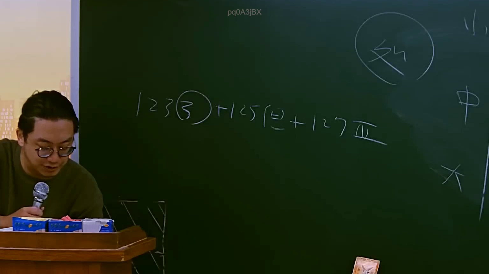

# 🎥 影音教材板書校對筆記
    - **來源影片**: [預約 11 2025-07-24 13-18-51-359](file:///J:/行政法A/ch11/預約 11 2025-07-24 13-18-51-359.mp4)
    - **課程分類**: `[行政法A`
    - **課堂章節**: `ch11]`
    - **影片時間戳記**: `01:04:00` (3840 秒)
    - **板書類型**: `影音板書`
    - **偵測時間**: 2026-07-22 05:35:52
    
    ## 🔍 擷取黑板板書對照圖
    
    
    ## 🧠 AI 智慧理解與知識庫演化註記
    ：
1. **板書內容辨識**：
   - 老師板書為：「123(3) + 125(2) + 127IV」。
   - 右上方有圈起的「外」字，右側有部分可見的「中」與「大」字，推測為課堂上對於法律體系或訴訟結構的補充說明。

2. **法條對照與學理分析**：
   - 此處明確指向《民法》關於請求權基礎與時效的條文組合。
   - **民法第 123 條第 3 項**：關於消滅時效完成之效力（時效完成後，債務人得拒絕給付）。
   - **民法第 125 條第 2 項**：提到請求權消滅時效之一般期間規定（原則為十五年，但法律有特別規定者，依其規定）。
   - **民法第 127 條第 8 款（板書誤記為 IV，應為第 8 款）**：針對特定請求權（如醫生、律師、商人等報酬）之二年短期時效規定。
   - **邏輯解讀**：老師在此處是在解析「消滅時效的法律體系」。透過 123 條（效力）、125 條（一般時效）、127 條（短期時效）的交叉引用，說明當請求權發生時，應如何判斷其時效期間以及時效完成後的法律效果。這通常用於侵權行為或債務不履行訴訟中，被告進行時效抗辯的法律基礎。
    
    ## 📊 可編輯之 Mermaid 關係流程圖
    ```mermaid
    ：
graph TD
    A["消滅時效法律體系"] --> B["民法第123條第3項：時效完成之法律效果"]
    A --> C["民法第125條：一般請求權時效(15年)"]
    A --> D["民法第127條：短期請求權時效(2年)"]
    B --> E["債務人得拒絕給付"]
    C --> F["適用原則"]
    D --> G["適用例外/特定職業報酬"]
    ```
    
    ## ✍️ 操作者手動校對修改區
    <!-- 您可以直接修改上方的文字或調整 Mermaid 區塊中的節點，Obsidian 會即時重新渲染 -->
    - [ ] 欄位結構與法律邏輯已校對無誤。
    - **校對筆記**: 
    