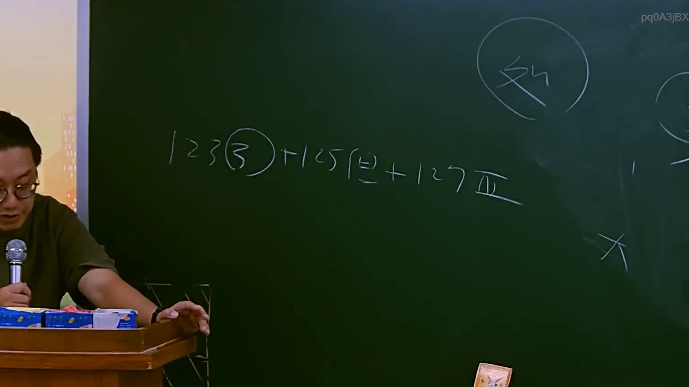

# 🎥 影音教材板書校對筆記
    - **來源影片**: [預約 11 2025-07-24 13-18-51-359](file:///J:/行政法A/ch11/預約 11 2025-07-24 13-18-51-359.mp4)
    - **課程分類**: `[行政法A`
    - **課堂章節**: `ch11]`
    - **影片時間戳記**: `01:21:15` (4875 秒)
    - **板書類型**: `影音板書`
    - **偵測時間**: 2026-07-22 05:36:03
    
    ## 🔍 擷取黑板板書對照圖
    
    
    ## 🧠 AI 智慧理解與知識庫演化註記
    ：
1. **板書內容辨識**：
   - 「123(3) + 125(2) + 127IV」
   - 右上方圈圈內有「外」（可能指涉外部性或外國法，但在該脈絡下多指涉「消滅時效」的結構組合）。

2. **法條對照與解讀**：
   此板書討論的是《民法》中關於「消滅時效」的期間適用邏輯，這在處理請求權基礎時至關重要：
   - **民法第123條第3項**：規定關於時效期間之計算，通常涉及時效起算點或期間屆滿之規定（依據上下文，可能探討的是時效完成之法律效果或中斷後的重行起算）。
   - **民法第125條第2項**：原則上請求權因十五年間不行使而消滅，但法律有特別規定者，不在此限。
   - **民法第127條第4項**：屬於「短期消滅時效」（二年時效），規定關於租金、薪資、寄託物、旅客食宿費用等請求權。
   - **學理邏輯**：老師將這三個條文列出並相加，意在建構「時效抗辯」的檢驗模型，即在一個法律案例中，請求權基礎可能同時涵蓋一般時效、特別時效或短期時效。實務上，若當事人提出時效抗辯，需優先檢視請求權類別，並按順序排查是否已屆滿，這是民法考科中「債權請求權」判斷的標準SOP。

3. **法律演化註記**：
   - 此處呈現的邏輯鏈條，是用於釐清「消滅時效抗辯權」的行使順序，提醒學生在撰寫法條分析時，須精確區分一般時效（125條）與特別規定（127條）的適用優先性。
    
    ## 📊 可編輯之 Mermaid 關係流程圖
    ```mermaid
    ：
graph TD
    A["消滅時效適用檢驗"] --> B["民法第123條第3項"]
    A --> C["民法第125條第2項"]
    A --> D["民法第127條第4項"]
    B --> E["期間計算與起算點認定"]
    C --> F["一般請求權時效 (15年)"]
    D --> G["短期請求權時效 (2年)"]
    E & F & G --> H["時效抗辯權行使"]
    ```
    
    ## ✍️ 操作者手動校對修改區
    <!-- 您可以直接修改上方的文字或調整 Mermaid 區塊中的節點，Obsidian 會即時重新渲染 -->
    - [ ] 欄位結構與法律邏輯已校對無誤。
    - **校對筆記**: 
    