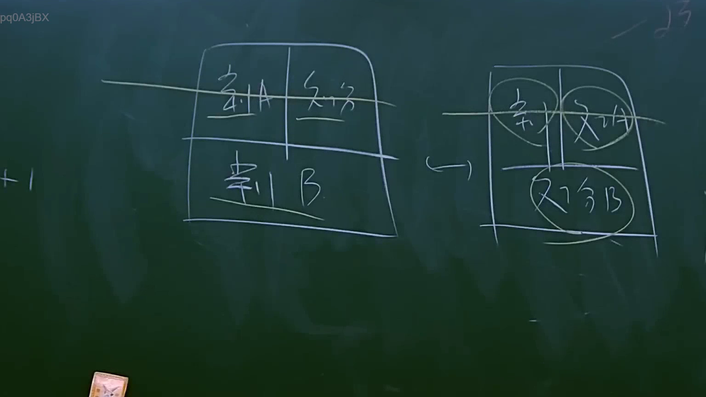

# 🎥 影音教材板書校對筆記
    - **來源影片**: [預約 11 2025-07-24 13-18-51-359](file:///J:/行政法A/ch11/預約 11 2025-07-24 13-18-51-359.mp4)
    - **課程分類**: `[行政法A`
    - **課堂章節**: `ch11]`
    - **影片時間戳記**: `01:25:30` (5130 秒)
    - **板書類型**: `影音板書`
    - **偵測時間**: 2026-07-22 05:36:12
    
    ## 🔍 擷取黑板板書對照圖
    
    
    ## 🧠 AI 智慧理解與知識庫演化註記
    ：
1. **板書文字辨識**：
   - 左側方格：上層分為「系A」、「系分」（疑為「關係」簡寫或特定類別），下層為「系B」。
   - 右側方格：對應轉換，上方圓圈內分別為「系」、「文份」，下方圓圈內為「分B」。
   - 整體邏輯：透過箭頭表示從左側分類架構向右側特定要素集合的轉化或演變。

2. **法律學理與爭點**：
   - 此板書呈現的是法律體系中「主體與客體」或「構成要件分組」的邏輯推演。在臺灣法律教學中，這類圖解常見於「物權編」或「親屬繼承編」的財產分配、應繼分計算，或是「債編」中多數債務人（連帶債務）的責任分攤與對外關係。
   - 連結至《民法》：若此圖涉及遺產分配，可對照《民法》第1144條（配偶之應繼分）及第1173條（歸扣）；若涉及債權債務，則對照第271條（可分之債）或第272條（連帶債務之定義）。左側的「系A/系B」可能代表不同性質的請求權基礎（例如侵權行為與債務不履行），右側則為責任歸屬的最終結算結果。
    
    ## 📊 可編輯之 Mermaid 關係流程圖
    ```mermaid
    ：
graph LR
    A1["系A"]
    A2["系分"]
    A3["系B"]
    B1["系"]
    B2["文份"]
    B3["分B"]
    subgraph "原始分類"
    A1 & A2 --> A3
    end
    A3 -- "轉換" --> B1 & B2 & B3
    subgraph "結果結算"
    B1 & B2 --> B3
    end
    ```
    
    ## ✍️ 操作者手動校對修改區
    <!-- 您可以直接修改上方的文字或調整 Mermaid 區塊中的節點，Obsidian 會即時重新渲染 -->
    - [ ] 欄位結構與法律邏輯已校對無誤。
    - **校對筆記**: 
    