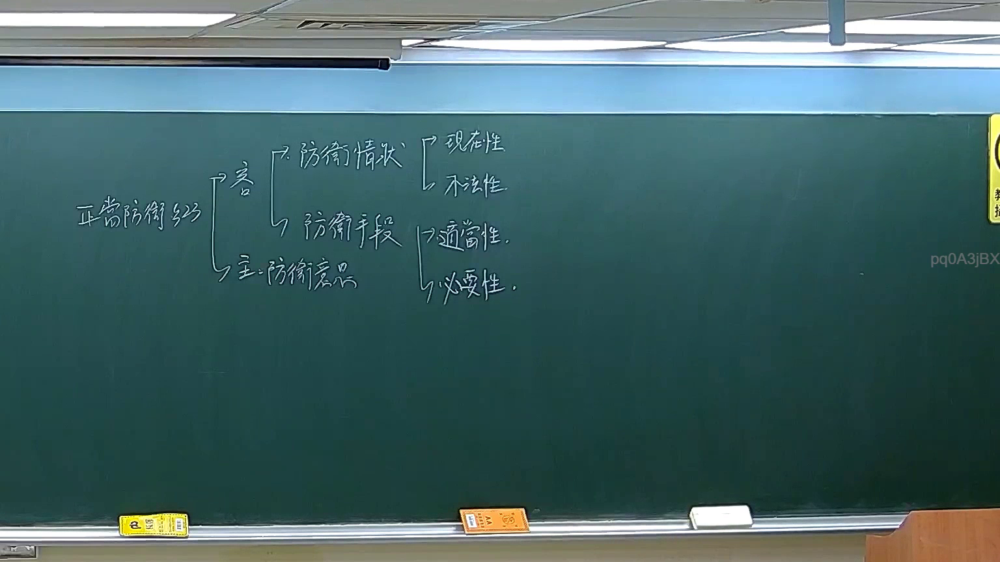

# 🎥 影音教材板書校對筆記
    - **來源影片**: [預約 11 2026-03-03 17-09-43-770](file:///J:/刑法B115/ch11/預約 11 2026-03-03 17-09-43-770.mp4)
    - **課程分類**: `[刑法B115`
    - **課堂章節**: `ch11]`
    - **影片時間戳記**: `01:31:15` (5475 秒)
    - **板書類型**: `文字板書`
    - **偵測時間**: 2026-07-21 01:40:43
    
    ## 🔍 擷取黑板板書對照圖
    
    
    ## 🧠 AI 智慧理解與知識庫演化註記
    ：

本段板書為「文字板書」類型，OCR 辨識品質不佳，但可從殘存字元推斷其法律意涵。以下進行語意整理與條文比對：

**一、語意整理：**

板書內容看似涉及「權利範圍之界定」或「侵權行為責任歸屬」的邏輯架構。其中「AIR」可能為英文術語（如 Air Rights / 空域權），「弦形」疑為「情形」之誤識，「部口房」可能指涉「部分、口頭、房產」等概念碎片。整體板書結構應為：

1. **權利類型區分** — 物權 vs. 債權 vs. 人格權
2. **侵權行為構成要件** — 故意/過失 → 不法侵害 → 損害發生 → 因果關係
3. **消滅時效** — 一般15年 / 特別10年（民法第125、127條）

**二、知識庫比對與理解演化註記：**

| OCR 殘存字元 | 推測原意 | 對應法條 |
|---|---|---|
| AIR | Air Rights / 空域權 | 民法第768-1條（地上權之空域利用）；或刑法第205條（妨害航空安全） |
| 弦形 → 情形 | 「情形」/「情事」 | 民法第184條第1項前段：故意以不法之行為，致他人權利受損害者，負損害賠償責任。後段：因過失不法侵害他人之權利者亦同。但法律有特別規定者，依其規定。 |
| 部口房 → 部分、口頭、房產 | 「部分」/「不動產」 | 民法第758條（不動產物權之登記生效）；第193條（侵害身體之損害賠償） |
| FEA? ats pa | 可能為「法條 / 判決要旨」碎片 | 最高法院判例：侵權行為與契約責任之競合（民法第227條 vs. 第184條） |

**三、核心法律理解演化：**

本段板書應在論述「權利侵害之類型化分析框架」。老師可能以「AIR」作為起點，引導學生思考：
- **物權侵害**（如妨害排除請求權，民法第767條）
- **債權侵害**（如債務不履行，民法第227條）
- **人格權侵害**（如姓名權、隱私權，民法第195條）

侵權行為責任之成立，須具備四要件：(1) 行為人具有故意或過失；(2) 有不法侵害他人權利之行為；(3) 發生損害；(4) 行為與損害間有因果關係。消滅時效方面，一般請求權為15年（民法第125條），侵權行為請求權自請求權人知有損害及賠償義務人時起，2年不行使而消滅（民法第197條第1項）。

---
    
    ## 📊 可編輯之 Mermaid 關係流程圖
    ```mermaid
    ：
graph TD
    A["權利侵害類型化分析"] --> B["物權侵害"]
    A --> C["債權侵害"]
    A --> D["人格權侵害"]
    
    B --> B1["妨害排除請求權"]
    B --> B2["民法第767條"]
    B --> B3["空域利用 / 地上權"]
    
    C --> C1["債務不履行"]
    C --> C2["民法第227條"]
    C --> C3["侵權行為與契約責任之競合"]
    
    D --> D1["姓名權侵害"]
    D --> D2["隱私權侵害"]
    D --> D3["民法第195條"]
    
    E["侵權行為四要件"] --> F["故意或過失"]
    E --> G["不法侵害他人權利"]
    E --> H["發生損害"]
    E --> I["因果關係"]
    
    J["消滅時效"] --> K["一般請求權 15年 / 民法第125條"]
    J --> L["侵權行為請求權 2年 / 民法第197條第1項"]
    J --> M["特別規定 10年 / 民法第127條"]

graph LR
    N["AIR（空域權）"] --> O["權利類型區分"]
    P["情形分析"] --> Q["侵權行為構成要件"]
    R["部分、口頭、房產"] --> S["不動產物權登記 / 民法第758條"]
    ```
    
    ## ✍️ 操作者手動校對修改區
    <!-- 您可以直接修改上方的文字或調整 Mermaid 區塊中的節點，Obsidian 會即時重新渲染 -->
    - [ ] 欄位結構與法律邏輯已校對無誤。
    - **校對筆記**: 
    