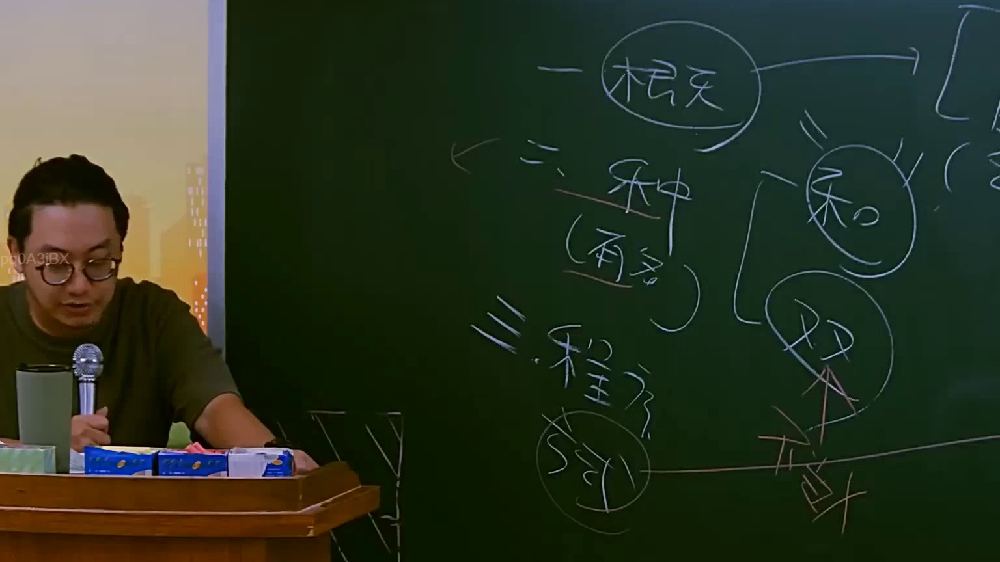

# 🎥 影音教材板書校對筆記
    - **來源影片**: [預約 12 2025-07-24 15-47-43-560](file:///J:/行政法A/ch12/預約 12 2025-07-24 15-47-43-560.mp4)
    - **課程分類**: `[行政法A`
    - **課堂章節**: `ch12]`
    - **影片時間戳記**: `00:55:45` (3345 秒)
    - **板書類型**: `影音板書`
    - **偵測時間**: 2026-07-22 06:35:51
    
    ## 🔍 擷取黑板板書對照圖
    
    
    ## 🧠 AI 智慧理解與知識庫演化註記
    ：

板書內容辨識如下：
一、概天（註：應為「概論」或「概念」，依語境推測）
二、種類（有名）
三、程序（形式）
右側並列：私（私法）、公（公法）

法律學理與法條對照：
1. 本板書核心在於區分法律體系的基礎架構。「一、概論」旨在釐清法學核心概念；「二、種類」區分法律規範類型，板書特別標註「有名」，應是指民法典中明文規定的「有名契約」（民法債編各論），與「無名契約」相對應。
2. 右側的「私」、「公」區分，對應臺灣法律體系的公私法二元論：
   - 「私法」：規範私人之間關係，核心為《民法》（私法自治、契約自由）。
   - 「公法」：規範國家與人民關係或組織運作，如《行政法》、《憲法》、《刑法》。
3. 「三、程序」應指「程序法」（如民事訴訟法、刑事訴訟法、行政訴訟法），與實體法（民法、刑法）相互對應，用以保障實體權利實現的過程。
4. 此板書旨在幫助初學者建立「法學三段論」基礎，即法律關係必須先釐清適用法領域（公/私）、契約類型（有名/無名），再透過程序法實現。
    
    ## 📊 可編輯之 Mermaid 關係流程圖
    ```mermaid
    ：
graph TD
    A["法律體系分類"] --> B["一、概論/概念"]
    A --> C["二、種類 (有名契約)"]
    A --> D["三、程序 (形式)"]
    C --> E["私法 (民法為主)"]
    C --> F["公法 (行政法/刑法)"]
    D -.-> E
    D -.-> F
    ```
    
    ## ✍️ 操作者手動校對修改區
    <!-- 您可以直接修改上方的文字或調整 Mermaid 區塊中的節點，Obsidian 會即時重新渲染 -->
    - [ ] 欄位結構與法律邏輯已校對無誤。
    - **校對筆記**: 
    