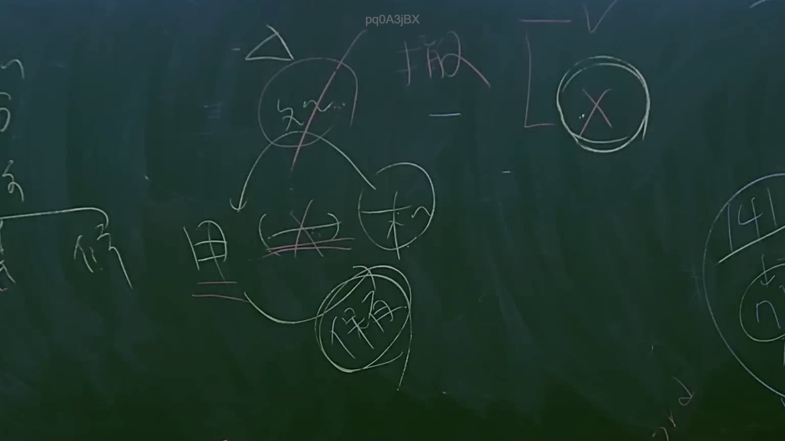

# 🎥 影音教材板書校對筆記
    - **來源影片**: [預約 12 2025-07-24 15-47-43-560](file:///J:/行政法A/ch12/預約 12 2025-07-24 15-47-43-560.mp4)
    - **課程分類**: `[行政法A`
    - **課堂章節**: `ch12]`
    - **影片時間戳記**: `01:14:15` (4455 秒)
    - **板書類型**: `影音板書`
    - **偵測時間**: 2026-07-22 06:36:00
    
    ## 🔍 擷取黑板板書對照圖
    
    
    ## 🧠 AI 智慧理解與知識庫演化註記
    ：
1. 板書文字辨識：
   - 核心邏輯：左上方三角形符號對應「撤」（撤銷），右上方有「V」與被圈選打叉的「X」。
   - 中間結構：上方圓圈為「效」（效力），下方引出「甲」、「乙」與「保有」三個節點。其中「甲」與「乙」之間畫了刪除線，暗示法律關係的變動或消滅。
   - 右側數字：出現「141」指向下方圓圈內的「7」，對應民法第141條關於消滅時效完成後之法律效果。
   - 綜合解讀：此板書主要探討法律行為（如契約）在「撤銷」後的效力狀態，並對照消滅時效制度。當一個法律行為被撤銷（撤銷權行使），其溯及既往失其效力（民法第114條），因此原有的權利義務關係（如甲與乙之間的債權債務）即不存在或被消滅。右側的「141條」提到時效完成後的法律效果，表示縱使時效完成，債務人仍有拒絕給付之抗辯權。

2. 法律條文對照：
   - 民法第114條：法律行為經撤銷者，視為自始無效。
   - 民法第141條：時效完成後，債務人得拒絕給付。
   - 民法第118條與無權處分之關聯：板書中出現「保有」，通常用於探討無權處分中，經權利人承認或取得權利後之「保有」權利狀態。
    
    ## 📊 可編輯之 Mermaid 關係流程圖
    ```mermaid
    ：
graph TD
    A["撤銷權行使"] --> B["法律行為效力"]
    B --> C["甲"]
    B --> D["乙"]
    C -. "法律關係消滅" .- D
    B --> E["保有權利狀態"]
    F["民法第141條"] --> G["時效完成後之抗辯權"]
    ```
    
    ## ✍️ 操作者手動校對修改區
    <!-- 您可以直接修改上方的文字或調整 Mermaid 區塊中的節點，Obsidian 會即時重新渲染 -->
    - [ ] 欄位結構與法律邏輯已校對無誤。
    - **校對筆記**: 
    