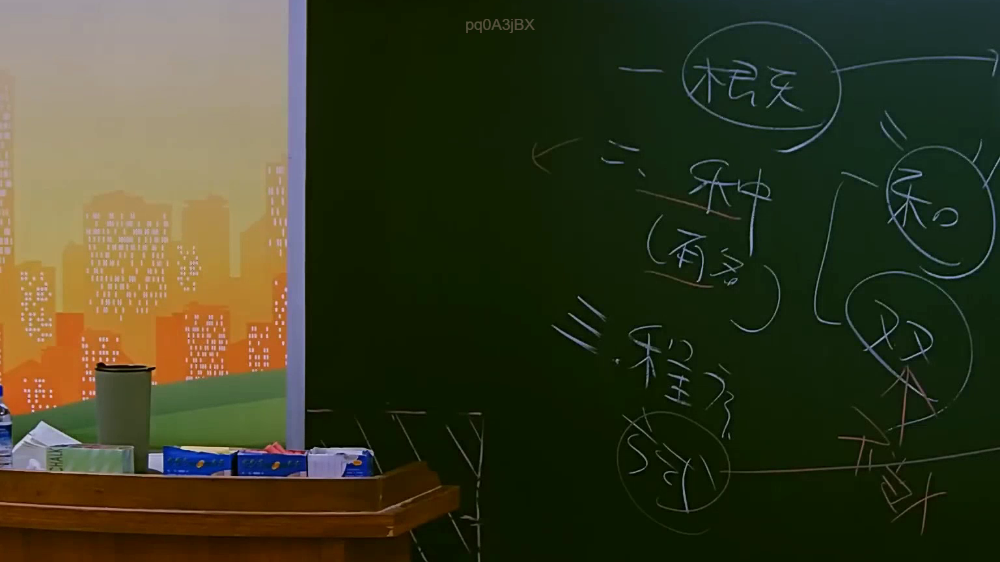

# 🎥 影音教材板書校對筆記
    - **來源影片**: [預約 12 2025-07-24 15-47-43-560](file:///J:/行政法A/ch12/預約 12 2025-07-24 15-47-43-560.mp4)
    - **課程分類**: `[行政法A`
    - **課堂章節**: `ch12]`
    - **影片時間戳記**: `01:15:00` (4500 秒)
    - **板書類型**: `影音板書`
    - **偵測時間**: 2026-07-22 06:36:58
    
    ## 🔍 擷取黑板板書對照圖
    
    
    ## 🧠 AI 智慧理解與知識庫演化註記
    ：

### 一、 板書高精度 OCR 辨識結果
本幅板書由老師以手寫粉筆字呈現，主要文字與結構關係如下：
1. **左側主架構：**
   - 「一 概念」
   - 「二 種（有名）」：「種」為「種類」之速記手寫體，下方註記「（有名）」，代表民法債編各論之有名契約（典型契約）。
   - 「三 程序」：下方畫有一圓圈，圈內寫有簡筆「契」（代表程序契約或訴訟上和解之契約性）。

2. **右側括號與關係群組：**
   - 右側以大括號 `{` 連結兩個圈選核心概念：
     - 上方圈選字：「和」（代表「和解」）。
     - 下方圈選字：「雙」（代表「雙方行為」）。
     - 在「雙」字下方寫有「契約」二字，並被以醒目的「X」（交叉）符號予以劃線刪除，用以表達否定或排除之意。

---

### 二、 法律詳細解讀與現行法條對照

本板書的核心在於論述**「和解」在民法（實體法）與民事訴訟法（程序法）交錯下的法律性質爭點**。

#### 1. 實體法上的和解契約（民法第736條）
- **一、概念：** 依民法第736條規定：「稱和解者，謂當事人約定，互相讓步，以終止爭執或防止爭執發生之契約。」
- **二、種類（有名契約）：** 和解在民法債編中屬於典型（有名）契約。它本質上是雙方當事人意思表示合致而成立的「雙方行為」（契約），且因互相讓步，通常具有有償性與雙務性。

#### 2. 程序法上的訴訟上和解與程序契約（民事訴訟法第377條、第380條）
當和解行為發生在法院的訴訟程序中，即為「訴訟上和解」。此時產生了「程序法」與「實體法」的競合，也是板書右半部分「契約二字被打叉」的核心學理爭點所在：
- **三、程序：** 指訴訟程序中之和解（民訴第377條）。訴訟上和解依民事訴訟法第380條第1項規定，與確定判決有同一之效力。
- **爭點（右側「雙方行為」下「契約」被打叉的涵義）：**
  關於「訴訟上和解」之性質，學說上有三大流派，板書具體呈現了**「訴訟行為說」**的思考路徑：
  1. **私法契約說：** 認為訴訟上和解本質仍為私法上之和解契約，訴訟程序僅是其發生的場合。
  2. **訴訟行為說（板書打叉之對位）：** 該說認為，訴訟上和解一經成立即產生終結訴訟之強大程序效力，其性質為**「雙方訴訟行為」**，而非一般的私法**「契約」**。為了強調其「訴訟行為性」並排除單純私法自治下的契約性質，故將「契約」二字劃去（打叉），強調其不受純粹私法契約法理（如任意撤銷、一般契約不履行之抗辯）的拘束。
  3. **雙重性格說（併存說／實務主流）：** 認為訴訟上和解同時具有「私法上和解契約」與「訴訟法上雙方訴訟行為」之雙重性格。若私法契約有瑕疵，當事人得提起宣告和解無效或撤銷和解之訴（民訴第380條第2項）。

透過這幅板書，老師精準地引導學生釐清：當和解進入「程序」層面時，它雖然仍是「雙」方行為，但在訴訟法學者或特定學說眼中，其「私法契約」的性質會被淡化或否定（打叉），轉而強調其作為「訴訟行為」的程序法效力。
    
    ## 📊 可編輯之 Mermaid 關係流程圖
    ```mermaid
    ：
graph TD
    Root["和解之法律性質與爭點分析"] --> One["一 概念 (民法第736條)"]
    Root --> Two["二 種類 (有名契約/典型契約)"]
    Root --> Three["三 程序 (程序契約/訴訟上和解)"]

    Three --> Dispute["訴訟上和解之本質爭議"]
    Dispute --> Ho["『和』 (實體法：和解契約)"]
    Dispute --> Shuang["『雙』 (程序法：雙方訴訟行為)"]
    
    Shuang --> CutContract["❌ 契約 (訴訟行為說：否定其私法契約性質)"]

    style CutContract fill#ffe6e6,stroke#ff0000,stroke-width2px
    style Shuang fill#e6f2ff,stroke#0066cc,stroke-width2px
    ```
    
    ## ✍️ 操作者手動校對修改區
    <!-- 您可以直接修改上方的文字或調整 Mermaid 區塊中的節點，Obsidian 會即時重新渲染 -->
    - [ ] 欄位結構與法律邏輯已校對無誤。
    - **校對筆記**: 
    