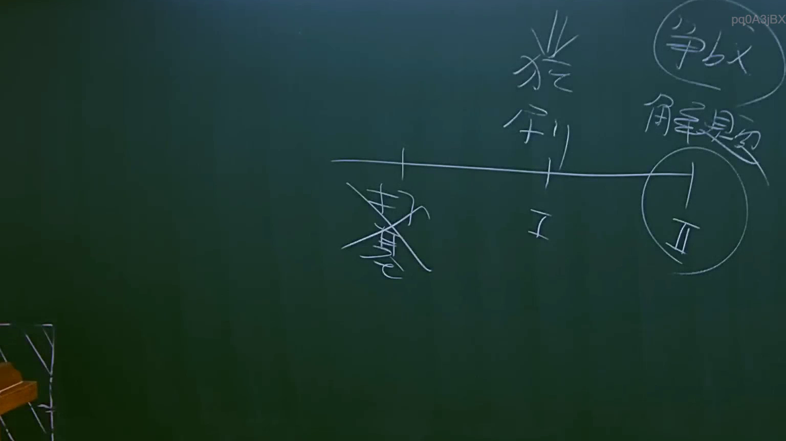

# 🎥 影音教材板書校對筆記
    - **來源影片**: [預約 12 2025-07-24 15-47-43-560](file:///J:/行政法A/ch12/預約 12 2025-07-24 15-47-43-560.mp4)
    - **課程分類**: `[行政法A`
    - **課堂章節**: `ch12]`
    - **影片時間戳記**: `01:22:15` (4935 秒)
    - **板書類型**: `影音板書`
    - **偵測時間**: 2026-07-22 06:37:03
    
    ## 🔍 擷取黑板板書對照圖
    
    
    ## 🧠 AI 智慧理解與知識庫演化註記
    ：
1. **板書辨識內容**：
   - 右上角：爭點、解題
   - 時間軸上段：獲利
   - 時間軸左側（被劃掉）：權利
   - 時間軸下方：I、II（標示出兩個不同的時點或階段）

2. **法律學理與解讀**：
   - 此板書呈現的是民法上關於「損害賠償」或「不當得利」的請求權時效與獲利計算邏輯。老師透過時間軸區分「階段 I」與「階段 II」。
   - 「權利」被劃掉，可能象徵該權利已罹於消滅時效（民法第125條以下）或已因拋棄等原因消滅。
   - 「獲利」與爭點的連結，常出現在民法第179條（不當得利）或第184條（侵權行為）損害賠償範圍的探討，特別是在「所受損害」與「所失利益」的計算上。
   - 爭點解題邏輯：在時間點 I 與 II 之間，針對獲利的歸屬或賠償範圍進行分析，判斷請求權基礎是否存在。此為司法官與律師考試中常見的「時效與請求權競合」解題架構。
    
    ## 📊 可編輯之 Mermaid 關係流程圖
    ```mermaid
    ：
graph LR
    A["時間軸起點"] --> B["階段 I"]
    B --> C["階段 II"]
    C --> D["爭點解題"]
    E["權利 (已消滅/劃掉)"] -.->|關聯| B
    F["獲利"] -.->|納入計算| C
    ```
    
    ## ✍️ 操作者手動校對修改區
    <!-- 您可以直接修改上方的文字或調整 Mermaid 區塊中的節點，Obsidian 會即時重新渲染 -->
    - [ ] 欄位結構與法律邏輯已校對無誤。
    - **校對筆記**: 
    