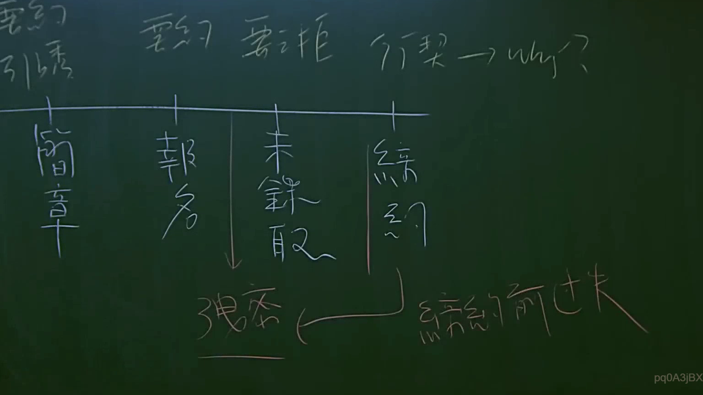

# 🎥 影音教材板書校對筆記
    - **來源影片**: [預約 12 2025-07-24 15-47-43-560](file:///J:/行政法A/ch12/預約 12 2025-07-24 15-47-43-560.mp4)
    - **課程分類**: `[行政法A`
    - **課堂章節**: `ch12]`
    - **影片時間戳記**: `01:33:45` (5625 秒)
    - **板書類型**: `影音板書`
    - **偵測時間**: 2026-07-22 06:37:13
    
    ## 🔍 擷取黑板板書對照圖
    
    
    ## 🧠 AI 智慧理解與知識庫演化註記
    ：
1. **板書內容辨識**：
   - 上方標題：要約、要約引誘、行契（契約）→ why?
   - 下方流程節點：簡章、報名、未錄取、締約
   - 底部關聯：強迫 → 締約前過失

2. **法律學理與爭點分析**：
   - 此板書探討的是契約成立過程中的法律性質界定。
   - 「簡章」發布通常被視為「要約之引誘」（民法第154條第2項但書），而非正式要約，因其缺乏受拘束之意思。
   - 「報名」行為則通常被視為「要約」。
   - 爭點在於若一方單方面拒絕締約（如未錄取），是否構成法律責任。板書提到「締約前過失」（民法第245條之1），即在契約締結前，因一方違反誠實信用原則，致他方受損害時的賠償責任。
   - 「強迫」與「締約前過失」的連線，暗示在報名與締約過程中，若有締約過失行為，可能導致賠償責任，或者是在討論強制締約（例如定型化契約下的特殊情形）的反思。

3. **法條對照**：
   - 民法第153條（契約之成立）：意思表示合致。
   - 民法第154條（要約之拘束力）：要約引誘與要約之區別。
   - 民法第245條之1（締約過失責任）：在契約未成立前，當事人之一方就訂約有過失時，應負損害賠償責任。
    
    ## 📊 可編輯之 Mermaid 關係流程圖
    ```mermaid
    ：
graph TD
    A["簡章"] -->|要約引誘| B["報名"]
    B -->|要約| C{"未錄取"}
    C -->|締約未成| D["締約前過失"]
    B -->|締約之可能| E["締約"]
    E -->|可能涉及| F["強迫"]
    D -.->|法律效果| F
    ```
    
    ## ✍️ 操作者手動校對修改區
    <!-- 您可以直接修改上方的文字或調整 Mermaid 區塊中的節點，Obsidian 會即時重新渲染 -->
    - [ ] 欄位結構與法律邏輯已校對無誤。
    - **校對筆記**: 
    