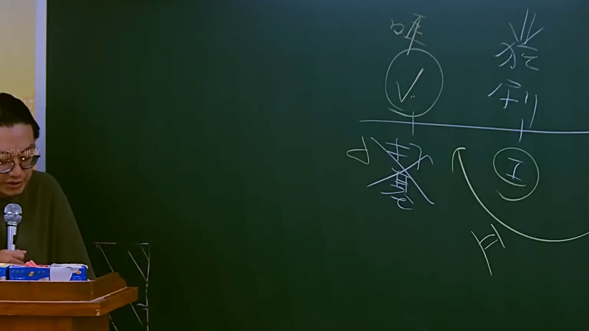

# 🎥 影音教材板書校對筆記
    - **來源影片**: [預約 12 2025-07-24 15-47-43-560](file:///J:/行政法A/ch12/預約 12 2025-07-24 15-47-43-560.mp4)
    - **課程分類**: `[行政法A`
    - **課堂章節**: `ch12]`
    - **影片時間戳記**: `02:08:45` (7725 秒)
    - **板書類型**: `影音板書`
    - **偵測時間**: 2026-07-22 06:38:16
    
    ## 🔍 擷取黑板板書對照圖
    
    
    ## 🧠 AI 智慧理解與知識庫演化註記
    ：
1. 板書文字內容：
   - 上方左側：「準」（帶有圈選與勾號）。
   - 上方右側：「權利」。
   - 下方左側：「非」（帶有刪除線）。
   - 下方右側：「I」、「II」（分別被圈選，並以箭頭串聯）。

2. 法律學理與爭點解析：
   此板書討論的核心為「請求權基礎」的構成要件論證邏輯，常見於民法侵權行為或債務不履行之教學：
   - 「準/權利」：指該請求權是否具備法律上的權利依據，即所謂的「請求權基礎」（Rechtsgrundlage）。
   - 「非」：否定說或反面論證，討論若欠缺某些要件，則無法構成請求權。
   - 「I、II」：通常指民法第184條侵權行為之類型化區分：
     - 第184條第1項前段（I）：因故意或過失，不法侵害他人之權利。
     - 第184條第1項後段（II）：故意以背於善良風俗之方法，加損害於他人。
   - 老師透過箭頭將兩者連結，說明在法律實務中，必須先檢驗權利是否存在，再根據構成要件（I 或 II）進行事實與法律的涵攝（Subsumtion）。

3. 臺灣法律條文對照：
   - 民法第184條（侵權行為之成立）：板書邏輯對應於判斷是否該當第1項前段之權利侵害（如生命、身體、健康、財產權），或第1項後段之純粹經濟損失。
   - 請求權基礎理論（ Anspruchsgrundlage）：教學中強調「誰得向誰，依據何種法律規定，請求什麼」。
    
    ## 📊 可編輯之 Mermaid 關係流程圖
    ```mermaid
    ：
graph TD
    A["請求權成立檢驗"] --> B["準/權利存在確認"]
    B --> C{條文構成要件}
    C --> D["I 民法第184條第1項前段 (侵害權利)"]
    C --> E["II 民法第184條第1項後段 (背於善良風俗)"]
    D -.-> F["非 欠缺構成要件則不成立"]
    E -.-> F
    ```
    
    ## ✍️ 操作者手動校對修改區
    <!-- 您可以直接修改上方的文字或調整 Mermaid 區塊中的節點，Obsidian 會即時重新渲染 -->
    - [ ] 欄位結構與法律邏輯已校對無誤。
    - **校對筆記**: 
    