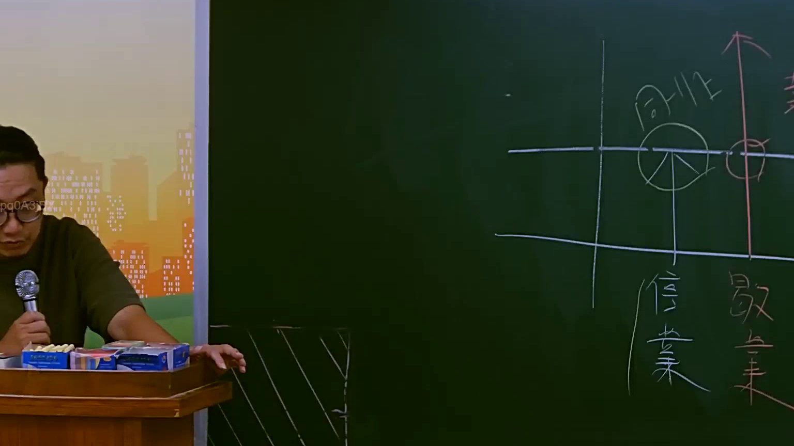

# 🎥 影音教材板書校對筆記
    - **來源影片**: [預約 14 2025-07-24 21-29-21-025](file:///J:/行政法A/ch14/預約 14 2025-07-24 21-29-21-025.mp4)
    - **課程分類**: `[行政法A`
    - **課堂章節**: `ch14]`
    - **影片時間戳記**: `00:46:15` (2775 秒)
    - **板書類型**: `影音板書`
    - **偵測時間**: 2026-07-22 05:53:39
    
    ## 🔍 擷取黑板板書對照圖
    
    
    ## 🧠 AI 智慧理解與知識庫演化註記
    ：

### 1. 板書高精度 OCR 識別結果
* **文字部分**：
  * 右上方：`同業`
  * 左下方：`信譽`（或寫作「信、業」，代表「信用」與「營業」）
  * 右下方：`故意`
* **圖形與關係符號**：
  * 背景為白色粉筆劃分的九宮格/座標軸。
  * `同業`下方繪有一個綠色圓形（內含三叉線，類似市佔率圓餅圖或同業競爭市場之示意）。
  * 右側有一條粉紅色垂直向上的箭頭，代表主觀不法意圖的升高或「故意」要件的判斷軸線。
  * 粉紅色箭頭與水平線交界處以紅圈標示，顯現出特定法規範的臨界點或構成要件交會。

---

### 2. 板書詳細解讀與法律學理
此板書展示了**「同業競爭中，故意侵害他人商譽或營業利益」**的侵權行為構成要件與法律適用邏輯。

當競爭對手（同業）在市場上進行不公平競爭時，其行為往往跨越了正當競爭的界線。板書透過座標軸與要素對比，理清了以下核心法理：

* **行為人關係（同業）**：
  此非一般不特定人之間的侵權，而是具有競爭關係的「同業」在同一市場市場（綠色圓餅圖代表市場版圖）中的行為。
* **主觀要件（故意）**：
  在自由競爭市場中，過失對他人造成業務影響通常不構成侵權（因競爭本有勝負）。然而，若行為人具備**「故意」**（以粉色向上箭頭強調其主觀惡性），甚至是以打擊對手為唯一目的，則跨越法律紅線。
* **侵害客體（信譽 / 營業）**：
  指原告的「商業信用」、「名譽」以及「營業秘密或營業利益」。

---

### 3. 臺灣現行法條對照與演化註記

本板書所對應的臺灣法律體系主要由**《民法》**與**《公平交易法》**雙軌併行：

1. **民法第184條第1項後段（故意不法侵害）**：
   * **條文**：「故意以違背善良風俗之方法，加損害於他人者亦同。」
   * **連結**：同業間若惡意散布謠言或以不正手段惡性競爭，因非侵害具體「物權」，而是侵害他人「純粹經濟上損失」或「營業利益」，必須訴諸本條之「故意違背善良風俗」要件。

2. **民法第195條第1項（人格權與信用權受損之非財產損害賠償）**：
   * **條文**：「不法侵害他人之身體、健康、名譽、自由、信用、隱私、貞操，或不法侵害其他人格法益而情節重大者，被害人雖非財產上之損害，亦得請求賠償相當之金額。其名譽被侵害者，並得請求回復名譽之適當處分。」
   * **連結**：對應板書中的「信譽」，同業若惡意詆毀，被害人可依此條請求排除侵害、名譽回復登報及慰撫金。

3. **公平交易法第22條（侵害營業信譽之禁止）**：
   * **條文**：「事業不得為競爭之目的，散布不實情事，損害他人之營業信譽。」
   * **連結**：此為特別法。若同業間具有「競爭目的」，且主觀上為「故意」散布不實言論損害對手「營業信譽」，直接適用本條，並可依同法第30條、第31條請求排除侵害與最高三倍之懲罰性損害賠償。
    
    ## 📊 可編輯之 Mermaid 關係流程圖
    ```mermaid
    ：
graph TD
    A["同業競爭關係 (市場競爭)"] --> B["主觀要件 故意"]
    A --> C["侵害客體 信譽 / 營業利益"]
    B --> D["不法侵害行為 (如散布不實言論)"]
    C --> D
    D --> E["法律責任與請求權"]
    E --> E1["民法第184條第1項後段<br>(故意違背善良風俗侵權)"]
    E --> E2["民法第195條第1項<br>(信用權與名譽權受損)"]
    E --> E3["公平交易法第22條<br>(惡意損害同業營業信譽)"]
    ```
    
    ## ✍️ 操作者手動校對修改區
    <!-- 您可以直接修改上方的文字或調整 Mermaid 區塊中的節點，Obsidian 會即時重新渲染 -->
    - [ ] 欄位結構與法律邏輯已校對無誤。
    - **校對筆記**: 
    