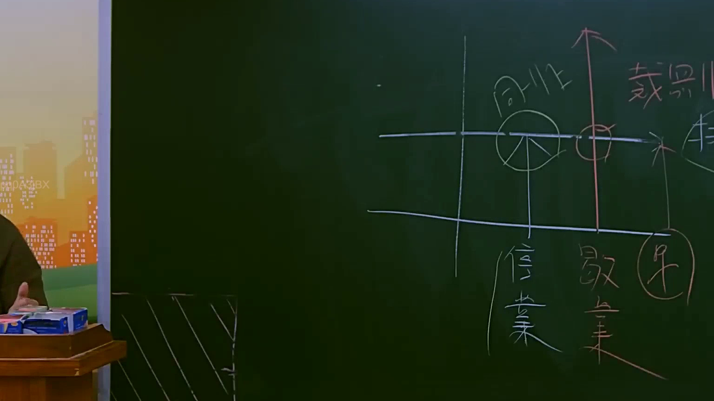

# 🎥 影音教材板書校對筆記
    - **來源影片**: [預約 14 2025-07-24 21-29-21-025](file:///J:/行政法A/ch14/預約 14 2025-07-24 21-29-21-025.mp4)
    - **課程分類**: `[行政法A`
    - **課堂章節**: `ch14]`
    - **影片時間戳記**: `00:48:45` (2925 秒)
    - **板書類型**: `影音板書`
    - **偵測時間**: 2026-07-22 05:54:09
    
    ## 🔍 擷取黑板板書對照圖
    
    
    ## 🧠 AI 智慧理解與知識庫演化註記
    ：

本幅板書呈現的是臺灣民事侵權行為法與公平交易法中，關於「侵害商業信譽」與「營業損害」之因果關係與裁判論理架構。

1. **板書文字高精度 OCR 辨識**：
   - 上方中央：「同非」（意指「同業」與「非同業」之競爭關係，或商品/服務之「相同」與「不相同」）。
   - 上方右側：「裁判」（指法院之司法審判與裁判基準）。
   - 下方左側：「信譽」（商譽、商業信用與名譽）。
   - 下方中央：「歇業」（營業終止、不營運之實質損害）。
   - 下方右側（圈選）：「果」（損害結果或因果關係之結尾）。
   - 圖形符號：一個區分「同非」的圓餅圖、一條貫穿「信譽」與「同非」並向上直指「裁判」的紅色箭頭（代表因果關係與訴訟請求路徑），以及指向「果」（歇業損害結果）的關係線。

2. **法律學理與爭點對照（臺灣現行法）**：
   - **侵害商譽之不法行為（「同非」與「信譽」）**：
     - 若屬「同業」間之惡意競爭，散布不實言論侵害他人商譽，構成**《公平交易法》第22條**（事業不得為競爭之目的，散布不實陳述，損害他人營業信譽）。
     - 若為「非同業」（一般人）之侵害行為，則回歸**《民法》第184條第1項**（一般侵權行為）及**第195條第1項**（侵害名譽/信用之非財產上損害賠償、回復名譽之適當處分）。
   - **營業損害之因果關係（「歇業」與「果」）**：
     - 當商譽（信譽）受損，進一步導致客戶流失、營業額下滑，甚至最終面臨「歇業」時，此「歇業」即為侵權行為所生之實質損害結果（果）。
     - 原告於訴訟中必須證明不法行為與「歇業」之間具有**「相當因果關係」**（民法第184條之構成要件）。
     - 損害賠償範圍依**《民法》第216條**，包含「所受損害」（如歇業清算損失）與「所失利益」（如本可預期獲得之營業利潤）。
   - **裁判實務之難點（「裁判」）**：
     - 法院在「裁判」此類案件時，核心爭點在於「商譽受損」至「歇業」之間的因果關係極難證明。常因市場競爭、經營不善等多重因素介入，導致法院在因果關係之認定上極為嚴格。板書以紅色箭頭由下往上貫穿，正是在說明從底層的「損害結果（信譽、歇業）」如何經由因果關係檢驗，最終上升到法院「裁判」責任成立的邏輯過程。
    
    ## 📊 可編輯之 Mermaid 關係流程圖
    ```mermaid
    ：
graph TD
    A["加害行為 (散布不實言論)"] --> B["競爭關係判定 (同業或非同業)"]
    B --> C["侵害營業信譽 (民法第195條 / 公平法第22條)"]
    C --> D["產生實質損害 (營業中斷 / 歇業)"]
    D --> E["因果關係判定 (相當因果關係)"]
    E --> F["法院裁判 (民法第184條 / 第216條 損害賠償)"]

    style B fill#fff,stroke#333,stroke-width1px
    style C fill#fff,stroke#333,stroke-width2px
    style D fill#fff,stroke#333,stroke-width2px
    style F fill#f9f,stroke#333,stroke-width2px
    ```
    
    ## ✍️ 操作者手動校對修改區
    <!-- 您可以直接修改上方的文字或調整 Mermaid 區塊中的節點，Obsidian 會即時重新渲染 -->
    - [ ] 欄位結構與法律邏輯已校對無誤。
    - **校對筆記**: 
    