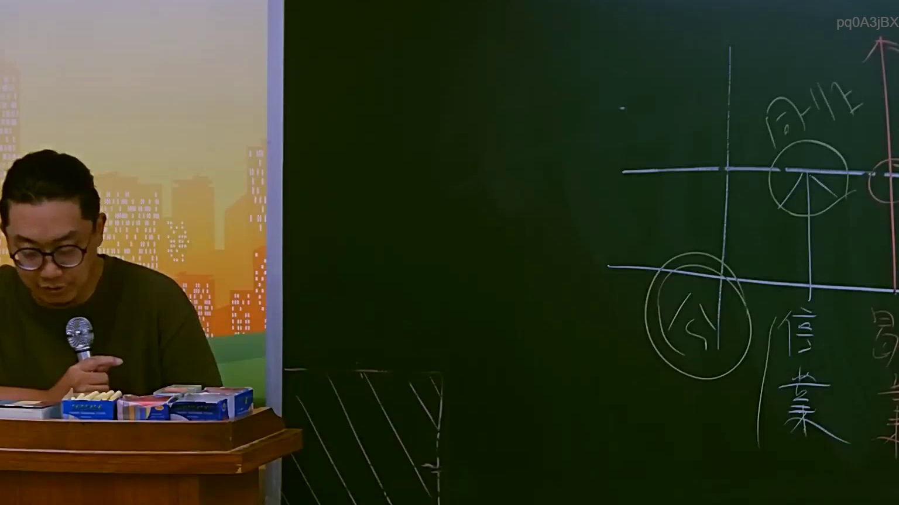

# 🎥 影音教材板書校對筆記
    - **來源影片**: [預約 14 2025-07-24 21-29-21-025](file:///J:/行政法A/ch14/預約 14 2025-07-24 21-29-21-025.mp4)
    - **課程分類**: `[行政法A`
    - **課堂章節**: `ch14]`
    - **影片時間戳記**: `00:51:45` (3105 秒)
    - **板書類型**: `影音板書`
    - **偵測時間**: 2026-07-22 05:54:29
    
    ## 🔍 擷取黑板板書對照圖
    
    
    ## 🧠 AI 智慧理解與知識庫演化註記
    ：
1. 板書文字辨識 (OCR)：
   - 核心關鍵字：同業、信譽、營業、公。
   - 圖形結構：以格狀座標系區分不同法律領域或關係。右上圓圈標註「同業」，下方圓圈標註「公」（推測為「公平交易法」之簡稱），右側垂直排列「信譽」與「營業」。

2. 法律學理與爭點解讀：
   - 本板書旨在區分「一般侵權行為」與「商業競爭侵權行為」的法律適用界線。
   - 【營業信譽之保護】：老師正講解當一家企業的「營業信譽」遭到侵害時，法律救濟的雙軌制。
   - 【私法救濟（民法）】：若行為涉及損害他人名譽或信用，適用臺灣《民法》第184條（獨立侵權行為）及第195條第1項（名譽權、信用權受損之非財產上損害賠償）。
   - 【競爭法救濟（公平交易法）】：若行為主體為「同業」（競爭對手），且行為目的係為了「競爭」，則會進入《公平交易法》的管轄。
     * 具體對應《公平交易法》第22條：「事業不得為競爭之目的，散布足以損害他人營業信譽之不實陳述。」
     * 若不符合第22條要件，但行為具有顯失公平之情狀，則可能落入《公平交易法》第25條之概括規定（帝王條款）。
   - 板書中的「公」字圓圈與座標軸暗示了「公信力」或「公眾/競爭秩序」的介入，區別於單純私人權利的侵害，強調市場競爭秩序的維護。

3. 演化註記：
   - 傳統民法保護的是靜態的「權利」，而公平交易法保護的是動態的「競爭秩序」。老師透過此圖示提醒學生，在處理商務案件時，必須同時檢索民法與公平法的競合關係。
    
    ## 📊 可編輯之 Mermaid 關係流程圖
    ```mermaid
    ：
graph TD
    A["同業 (競爭主體)"] -- "競爭行為" --> B["侵害行為"]
    B -- "不實陳述/詆毀" --> C["營業信譽 (受損客體)"]
    C --> D["民法救濟"]
    C --> E["公平交易法救濟"]
    D --> D1["民法第184條 (侵權行為)"]
    D --> D2["民法第195條 (信用權/名譽權)"]
    E --> E1["公平法第22條 (營業信譽保護)"]
    E --> E2["公平法第25條 (顯失公平行為)"]
    F["公 (市場秩序/公法領域)"] -.-> E
    style A fill#f9f,stroke#333,stroke-width2px
    style C fill#bbf,stroke#333,stroke-width2px
    style F fill#dfd,stroke#333,stroke-dasharray 5 5
    ```
    
    ## ✍️ 操作者手動校對修改區
    <!-- 您可以直接修改上方的文字或調整 Mermaid 區塊中的節點，Obsidian 會即時重新渲染 -->
    - [ ] 欄位結構與法律邏輯已校對無誤。
    - **校對筆記**: 
    