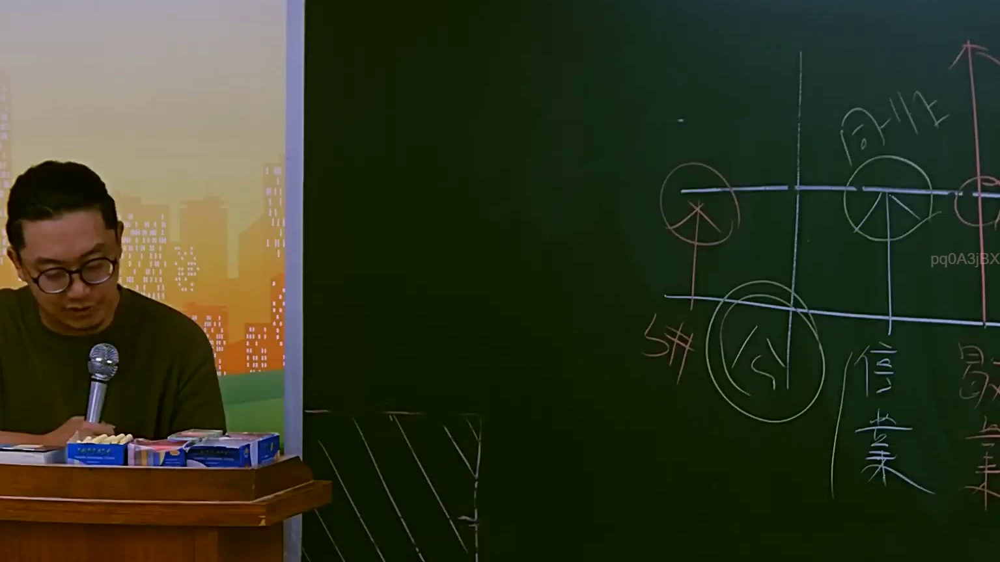

# 🎥 影音教材板書校對筆記
    - **來源影片**: [預約 14 2025-07-24 21-29-21-025](file:///J:/行政法A/ch14/預約 14 2025-07-24 21-29-21-025.mp4)
    - **課程分類**: `[行政法A`
    - **課堂章節**: `ch14]`
    - **影片時間戳記**: `01:01:45` (3705 秒)
    - **板書類型**: `影音板書`
    - **偵測時間**: 2026-07-22 05:55:08
    
    ## 🔍 擷取黑板板書對照圖
    
    
    ## 🧠 AI 智慧理解與知識庫演化註記
    ：

### 1. 板書高精度 OCR 識別
*   **左上圓圈**：代表人像符號（代表公司內部人，如董事、監察人或經理人）。
*   **左下圓圈**：書寫「公」字（代表「公司」）。
*   **左下圓圈旁符號**：書寫「5#」或「與」（通常於法律速記中代表「5年」消滅時效，或代表「與」之連結關係）。
*   **右上圓圈**：書寫「同業」，內部亦有人像符號（代表外部之競爭同業、競業對象或另一家公司）。
*   **右下文字**：
    *   第一縱列：「信義」（代表「信義義務」/ Fiduciary Duty）。
    *   第二縱列：「競業」（代表「競業禁止義務」/ Non-compete）。
*   **結構線條**：
    *   中央縱向白線：區隔「公司內部」與「公司外部（同業）」的法律關係界線。
    *   橫向白線：連結內部人、公司與外部競業關係之法律行為路徑。

---

### 2. 法律學理、爭點與現行法條對照

本板書的核心在於解析**公司負責人（董事、經理人）的「信義義務（Fiduciary Duty）」與「競業禁止（Duty not to compete）」之法律關係與責任體系**：

#### (1) 信義義務（Fiduciary Duty）與公司法第 23 條
*   **學理說明**：董事與公司之間屬於「委任關係」（民法第544條、公司法第192條第4項）。董事對公司負有信義義務，在臺灣法下具體化為**「忠實義務（Duty of Loyalty）」**與**「善良管理人注意義務（Duty of Care）」**（公司法第23條第1項）。
*   板書左半部「內部人」指向「公（公司）」，即在說明內部人對公司所應背負的這層高度信任與忠實關係。

#### (2) 競業禁止義務（Non-compete Duty）與衝突規範
*   **學理與爭點**：當負責人跨越公司界線，對外從事「同業」（板書右上圓圈）之商業行為時，即產生**利益衝突（Conflict of Interest）**。此時將觸發「競業禁止義務」。
*   **現行法條對照**：
    *   **董事之競業禁止**：**公司法第 209 條第 1 項**規定，董事為自己或他人為屬於公司營業範圍內之行為，應向股東會說明其重要內容並取得其許可（許可之適法程序）。
    *   **經理人之競業禁止**：**公司法第 32 條**規定，經理人不得兼任其他營利事業之經理人，亦不得自營或為他人經營同類之業務。

#### (3) 違反之救濟：歸入權與時效
*   **歸入權（Right of Entry / Disgorgement）**：
    *   若董事違反公司法第209條第1項，股東會得以決議將其因該行為所得之利益，視為公司之所得（**公司法第209條第5項**）。
    *   **消滅時效**：此歸入權之行使期間極短，自所得產生後「**一年**」內不行使而消滅（公司法第209條第5項後段）。
*   **損害賠償與 5 年時效（板書之「5#」）**：
    *   若依據**公司法第 23 條第 1 項**或**民法第 544 條（受任人違反義務之損害賠償）**請求損害賠償，其時效適用一般債權之 **15 年**（民法第125條）。
    *   然而，若涉及**證券交易法相關責任**（如財報不實、內線交易或非常規交易），或特定商事法上之損害賠償，常有 **5 年**之長期消滅時效（例如證交法第20條之1第5項、或民法上部分因侵權行為而生之長期時效上限，以及公司法其他責任規範）。板書中「5#」即可能在對比「1年之歸入權短期時效」與「5年/15年之一般或特別損害賠償時效」之法律適用差異。

---
    
    ## 📊 可編輯之 Mermaid 關係流程圖
    ```mermaid
    ：
graph TD
    subgraph Internal ["公司內部界線 (Internal)"]
        A["董事 / 經理人"]
        B["公司 ('公')"]
    end

    subgraph External ["公司外部界線 (External)"]
        C["同業 / 競業對象"]
    end

    A -->|"負有信義義務<br>(公司法 §23 I)"| B
    A -.->|"跨越界線從事競業"| C
    
    C -->|"產生利益衝突"| D["競業禁止義務<br>(公司法 §209, §32)"]
    
    B -->|"違反時行使：歸入權"| E["歸入權 (1年時效)<br>(公司法 §209 V)"]
    B -->|"違反時行使：損害賠償"| F["損害賠償 (5年或15年時效)<br>(民法 §544 / 公司法 §23)"]

    style Internal fill#f5faff,stroke#0055aa,stroke-width2px
    style External fill#fff5f5,stroke#aa0000,stroke-width2px
    ```
    
    ## ✍️ 操作者手動校對修改區
    <!-- 您可以直接修改上方的文字或調整 Mermaid 區塊中的節點，Obsidian 會即時重新渲染 -->
    - [ ] 欄位結構與法律邏輯已校對無誤。
    - **校對筆記**: 
    