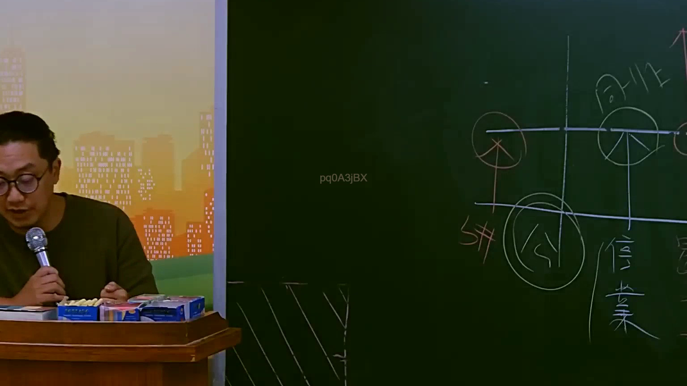

# 🎥 影音教材板書校對筆記
    - **來源影片**: [預約 14 2025-07-24 21-29-21-025](file:///J:/行政法A/ch14/預約 14 2025-07-24 21-29-21-025.mp4)
    - **課程分類**: `[行政法A`
    - **課堂章節**: `ch14]`
    - **影片時間戳記**: `01:19:45` (4785 秒)
    - **板書類型**: `影音板書`
    - **偵測時間**: 2026-07-22 05:56:40
    
    ## 🔍 擷取黑板板書對照圖
    
    
    ## 🧠 AI 智慧理解與知識庫演化註記
    ：
1. 板書文字辨識：
   - 「同仁」（或「同上」之變體，但在圖示脈絡下多指涉特定群體或當事人）
   - 「公」（置於圓圈中，指涉「公司」或「公法人」等主體）
   - 「信」（位於右側下方，推測為「信託」或「信賴」相關概念）
   - 「業」（位於「信」字下方，推測為「行業」、「業務」或「營業」）

2. 法律學理與爭點解析：
   - 板書呈現為法學教學中常見的「主體關係圖」。中間的十字架構將法律關係分為四個象限，左上與右上分別對應不同法律主體（如債權人、債務人或法人與自然人）。
   - 「公」與「信業」的垂直排列，暗示了「公法上的信賴保護原則」或是「商業經營中的信託義務」。
   - 關聯法條：
     - 若涉及「公」與「信業」之責任，通常對應《公司法》第23條（負責人之忠實義務與損害賠償責任）。
     - 若涉及公權力對私人之影響，則涉及《行政程序法》第8條之信賴保護原則。
     - 此圖可能正在講述公司治理下的法律關係，即當事人（同仁）與公司（公）之間，如何受到業務（信業）規範的約束。
    
    ## 📊 可編輯之 Mermaid 關係流程圖
    ```mermaid
    ：
graph TD
    A["同仁"] --> B["公司"]
    B --> C["信賴與業務規範"]
    D["公法人/公權力"] --> E["信業架構"]
    B --- E
    ```
    
    ## ✍️ 操作者手動校對修改區
    <!-- 您可以直接修改上方的文字或調整 Mermaid 區塊中的節點，Obsidian 會即時重新渲染 -->
    - [ ] 欄位結構與法律邏輯已校對無誤。
    - **校對筆記**: 
    