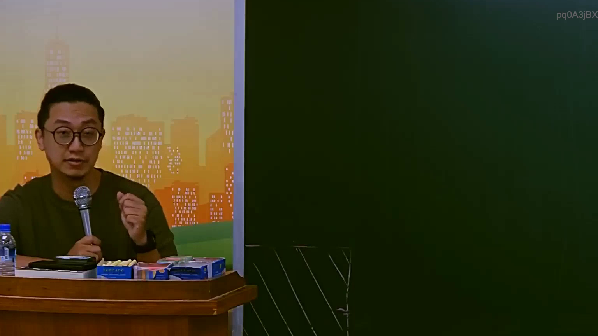

# 🎥 影音教材板書校對筆記
    - **來源影片**: [預約 14 2025-07-24 21-29-21-025](file:///J:/行政法A/ch14/預約 14 2025-07-24 21-29-21-025.mp4)
    - **課程分類**: `[行政法A`
    - **課堂章節**: `ch14]`
    - **影片時間戳記**: `01:23:15` (4995 秒)
    - **板書類型**: `影音板書`
    - **偵測時間**: 2026-07-22 05:56:49
    
    ## 🔍 擷取黑板板書對照圖
    
    
    ## 🧠 AI 智慧理解與知識庫演化註記
    ：
經分析影像內容，目前該時間點 83 分 15 秒，黑板呈現為「空白狀態」，老師正在進行口頭講授或板書前的引導，並未在板面上書寫任何文字或繪製圖表。

由於圖片中無法律文字或關係圖，無法進行 OCR 辨識或進階法條對照。建議提供老師開始書寫後的畫面截圖，以便進行專業的法律邏輯拆解與 Mermaid 流程圖繪製。
    
    ## 📊 可編輯之 Mermaid 關係流程圖
    ```mermaid
    ：
graph TD
    A["目前黑板狀態：空白"] --> B["等待老師書寫"]
    ```
    
    ## ✍️ 操作者手動校對修改區
    <!-- 您可以直接修改上方的文字或調整 Mermaid 區塊中的節點，Obsidian 會即時重新渲染 -->
    - [ ] 欄位結構與法律邏輯已校對無誤。
    - **校對筆記**: 
    