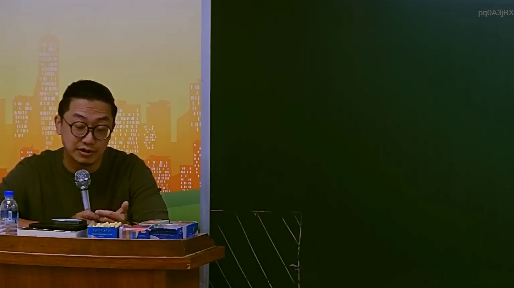

# 🎥 影音教材板書校對筆記
    - **來源影片**: [預約 14 2025-07-24 21-29-21-025](file:///J:/行政法A/ch14/預約 14 2025-07-24 21-29-21-025.mp4)
    - **課程分類**: `[行政法A`
    - **課堂章節**: `ch14]`
    - **影片時間戳記**: `01:24:30` (5070 秒)
    - **板書類型**: `影音板書`
    - **偵測時間**: 2026-07-22 05:56:59
    
    ## 🔍 擷取黑板板書對照圖
    
    
    ## 🧠 AI 智慧理解與知識庫演化註記
    ：
經仔細分析影像內容，畫面中老師正在進行課堂講授，但黑板區域並未出現文字、符號或邏輯結構圖。板書區域目前呈現為空白（或僅有反光斜線），因此無法進行 OCR 文字辨識與法律邏輯推演。

若後續影片中老師書寫了相關法條（如民法第184條、侵權行為損害賠償、債務不履行等內容），請於該時間點再次截圖，我將立即為您進行精確的法律解析與 Mermaid 邏輯圖繪製。

目前狀態：板書為空白。
    
    ## 📊 可編輯之 Mermaid 關係流程圖
    ```mermaid
    ：
graph TD
    A["目前無板書內容"] --> B["等待老師書寫"]
    ```
    
    ## ✍️ 操作者手動校對修改區
    <!-- 您可以直接修改上方的文字或調整 Mermaid 區塊中的節點，Obsidian 會即時重新渲染 -->
    - [ ] 欄位結構與法律邏輯已校對無誤。
    - **校對筆記**: 
    