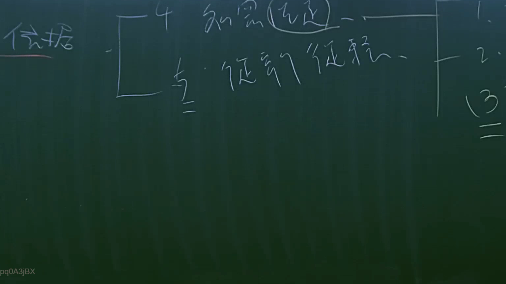

# 🎥 影音教材板書校對筆記
    - **來源影片**: [預約 14 2025-07-24 21-29-21-025](file:///J:/行政法A/ch14/預約 14 2025-07-24 21-29-21-025.mp4)
    - **課程分類**: `[行政法A`
    - **課堂章節**: `ch14]`
    - **影片時間戳記**: `01:28:45` (5325 秒)
    - **板書類型**: `影音板書`
    - **偵測時間**: 2026-07-22 05:57:11
    
    ## 🔍 擷取黑板板書對照圖
    
    
    ## 🧠 AI 智慧理解與知識庫演化註記
    ：

一、板書文字辨識：
板書主題為「依據」，其下分為兩點分支：
1. 「4 知悉（法定）」：此處特別圈選「法定」二字，應是指法律規定知悉的特定時點。
2. 「5 從事之從事」：此處語意應為「從事之從事行為」或針對某種行為態樣的分類，右側接續編號「1、2、3」。

二、法律學理與法條對照：
此板書呈現的是法律實務中關於「請求權時效起算點」或「除斥期間」認定的判斷標準：
1. 「知悉」：對應臺灣民法第197條第1項關於侵權行為損害賠償請求權之時效規定：「因侵權行為所生之損害賠償請求權，自請求權人知有損害及賠償義務人時起，二年間不行使而消滅」。此處板書強調「知悉」作為起算點的法定要件，即「主觀知悉」與「客觀事實」的結合。
2. 「從事之從事」：此可能是在探討侵權行為的「行為時」與「結果發生時」之區別，或是在討論行為人是否基於特定的法律地位（如職務上之從事）而產生責任。這與民法第184條侵權行為責任之成立要件息息相關，特別是針對「過失」或「故意」行為的判斷基準。

三、綜合演化：
法律邏輯在處理此類案件時，通常採取「客觀事實」作為基礎，再輔以「主觀知悉」作為時效啟動的開關。板書提到的分類，反映了法律在處理責任歸屬時，必須先釐清行為人是「從事」何種法律行為，以及權利人何時「知悉」，以確保法安定性。
    
    ## 📊 可編輯之 Mermaid 關係流程圖
    ```mermaid
    ：

graph TD
    A["依據基礎"] --> B["4 知悉 (法定)"]
    A --> C["5 從事之從事"]
    B --> D["時效起算點 民法第197條"]
    C --> E["行為責任判斷 民法第184條"]
    E --> F["項目 1"]
    E --> G["項目 2"]
    E --> H["項目 3"]
    ```
    
    ## ✍️ 操作者手動校對修改區
    <!-- 您可以直接修改上方的文字或調整 Mermaid 區塊中的節點，Obsidian 會即時重新渲染 -->
    - [ ] 欄位結構與法律邏輯已校對無誤。
    - **校對筆記**: 
    