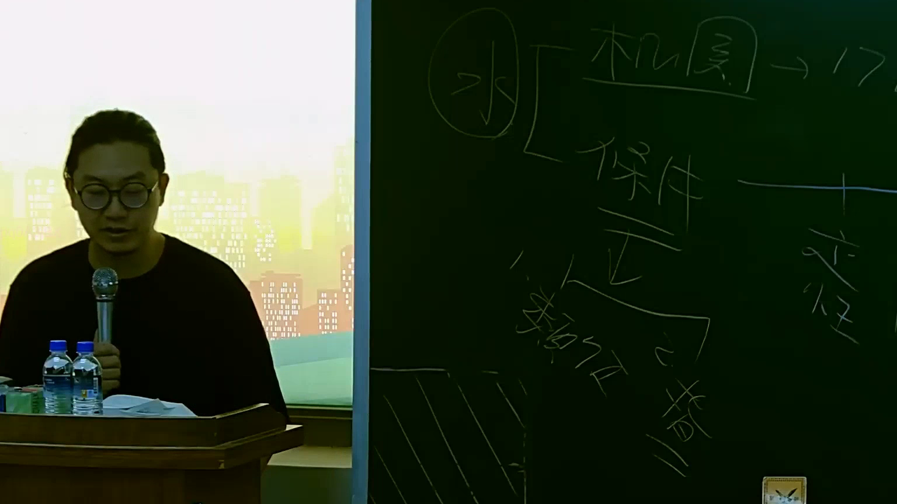

# 🎥 影音教材板書校對筆記
    - **來源影片**: [預約 15 2025-07-24 23-56-40-135](file:///J:/行政法A/ch15/預約 15 2025-07-24 23-56-40-135.mp4)
    - **課程分類**: `[行政法A`
    - **課堂章節**: `ch15]`
    - **影片時間戳記**: `00:21:45` (1305 秒)
    - **板書類型**: `影音板書`
    - **偵測時間**: 2026-07-22 06:13:00
    
    ## 🔍 擷取黑板板書對照圖
    
    
    ## 🧠 AI 智慧理解與知識庫演化註記
    ：
這張板書內容主要探討的是「行政法中類推適用民法關於條件成就之原理」，特別是在「給水行政」或「給付行政」的脈絡下，當行政機關的行為影響了法律效果的發生條件時之處理邏輯。

1.  **關鍵文字辨識（OCR）**：
    *   **(水)**：圓圈內的「水」字，在臺灣法學速記中通常代表「給水行政」（Provision of benefits）或「給付行政」。
    *   **機關 → 17**：指「行政機關」應遵守《行政程序法》第 17 條之規定。該條規定機關對於申請書件不完備時，負有通知補正的義務。
    *   **條件 / 正**：代表法律關係中設定的「條件」，「正」通常代表條件成就（Positive fulfillment）。
    *   **類推**：指「類推適用」（Analogy），這是法律漏洞補充的重要方法。
    *   **故意 / 措施**：指行政機關採取了某些特定的手段或行為。

2.  **法律學理與爭點解讀**：
    *   **核心議題**：當行政機關為了避免給付義務發生，而「故意」採取某些「措施」來阻礙申請人達成法定條件時，法律應如何救濟？
    *   **法條對照與類推適用**：
        *   **民法第 101 條第 1 項**：「因條件成就而受不利益之當事人，以不正當行為阻礙其條件之成就者，視為條件已成就。」
        *   在行政法領域，若行政機關違反**《行政程序法》第 17 條**之補正指導義務，或以其他故意措施阻礙人民取得給付的條件成就（例如故意延遲收件以逾越時效），此時雖然行政法本身可能缺乏明文，但基於誠實信用原則與公平正義，應「**類推適用民法第 101 條**」之規定。
    *   **法律演化**：此板書反映了行政法學界將私法中關於「誠實信用」與「條件成就」的法理，透過類推適用轉化為公法上的原則，用以約束行政權的不當作為。
    
    ## 📊 可編輯之 Mermaid 關係流程圖
    ```mermaid
    ：
graph TD
    A["(水) 給水行政/給付行為"] --> B["行政機關 (義務依據 行政程序法§17)"]
    B --> C["採取故意措施/行為"]
    C --> D{"阻礙法律條件成就"}
    D -- "不正當行為" --> E["類推適用 民法§101第1項"]
    E --> F["法律效果：視為條件已成就"]
    F --> G["人民獲得權利/給付保障"]
    ```
    
    ## ✍️ 操作者手動校對修改區
    <!-- 您可以直接修改上方的文字或調整 Mermaid 區塊中的節點，Obsidian 會即時重新渲染 -->
    - [ ] 欄位結構與法律邏輯已校對無誤。
    - **校對筆記**: 
    