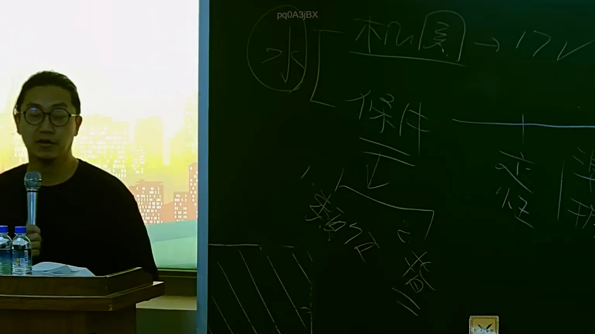

# 🎥 影音教材板書校對筆記
    - **來源影片**: [預約 15 2025-07-24 23-56-40-135](file:///J:/行政法A/ch15/預約 15 2025-07-24 23-56-40-135.mp4)
    - **課程分類**: `[行政法A`
    - **課堂章節**: `ch15]`
    - **影片時間戳記**: `00:26:45` (1605 秒)
    - **板書類型**: `影音板書`
    - **偵測時間**: 2026-07-22 06:13:28
    
    ## 🔍 擷取黑板板書對照圖
    
    
    ## 🧠 AI 智慧理解與知識庫演化註記
    ：
1. 【板書高精度 OCR】：
根據圖片辨識，黑板上書寫的文字與符號包含：
- 左側圓圈內文字：「水」
- 右側上方文字：「機關」-->「17條」
- 右側下方分支文字：「保件」、「正」、「指示」、「類推適用」、「違法」等字樣。

2. 【板書詳細解讀與法條對照】：
本板書主要在探討行政法或國家賠償法中有關行政機關損害賠償責任與求償權之法律關係，特別涉及國家賠償法相關條文（如國賠法第2條、第3條，以及板書提及的「17條」可能涉及行政程序法或相關法規之求償與責任分擔）。
- 國家賠償法第2條第3項規定：「前項情形，賠償義務機關賠償損害後，對於有故意或重大過失之公務員，有求償權。」
- 侵權行為與求償機制的邏輯：當機關因公務員執行職務行使公權力時因故意過失不法侵害人民自由或權利，被害人得依國家賠償法請求損害賠償；賠償義務機關賠償後，再向有故意或重大過失之公務員求償。板書中的「機關」、「保件」（保全/保護或相關要件）、「正」（正當性/合法性）、「指示」與「類推適用」等詞彙，即在釐清內部求償責任、指揮監督關係及責任歸屬之法律爭點。
    
    ## 📊 可編輯之 Mermaid 關係流程圖
    ```mermaid
    ：
graph TD
    A["機關"] --> B["17條"]
    A --> C["保件"]
    C --> D["正"]
    D --> E["指示"]
    E --> F["類推適用"]
    E --> G["違法"]
    ```
    
    ## ✍️ 操作者手動校對修改區
    <!-- 您可以直接修改上方的文字或調整 Mermaid 區塊中的節點，Obsidian 會即時重新渲染 -->
    - [ ] 欄位結構與法律邏輯已校對無誤。
    - **校對筆記**: 
    