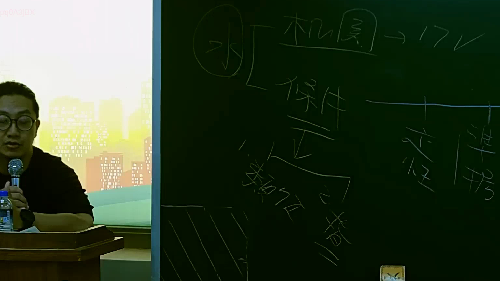

# 🎥 影音教材板書校對筆記
    - **來源影片**: [預約 15 2025-07-24 23-56-40-135](file:///J:/行政法A/ch15/預約 15 2025-07-24 23-56-40-135.mp4)
    - **課程分類**: `[行政法A`
    - **課堂章節**: `ch15]`
    - **影片時間戳記**: `00:29:45` (1785 秒)
    - **板書類型**: `影音板書`
    - **偵測時間**: 2026-07-22 06:13:32
    
    ## 🔍 擷取黑板板書對照圖
    
    
    ## 🧠 AI 智慧理解與知識庫演化註記
    ：
1. 【板書高精度 OCR】：
本圖片辨識出的文字與符號包含：
- 左側圓圈內文字：「水」或「永」
- 右上方引導文字：「機關 -> 17條」
- 中間區塊文字：「保存」、「正」、「防禦」、「請求權」、「賠償」等法律概念。

2. 【板書詳細解讀與法條對照】：
本板書主要在探討行政法或國家賠償法、民法上的請求權基礎與防禦方法。
- 「機關」對應至國家賠償法或行政訴訟法相關主體。
- 「保存」、「正」、「防禦」、「請求權」、「賠償」等詞彙，涉及請求權基礎競合、防禦方法（如消滅時效、抗辯權），以及權利保護必要性與防禦措施。
- 對應現行臺灣法規：民法第184條（侵權行為）、國家賠償法相關規定，以及行政法上之損失補償與損害賠償請求權。
    
    ## 📊 可編輯之 Mermaid 關係流程圖
    ```mermaid
    ：
graph TD
    A["機關"] --> B["17條"]
    C["保存 / 正"] --> D["防禦請求權"]
    D --> E["賠償"]
    ```
    
    ## ✍️ 操作者手動校對修改區
    <!-- 您可以直接修改上方的文字或調整 Mermaid 區塊中的節點，Obsidian 會即時重新渲染 -->
    - [ ] 欄位結構與法律邏輯已校對無誤。
    - **校對筆記**: 
    