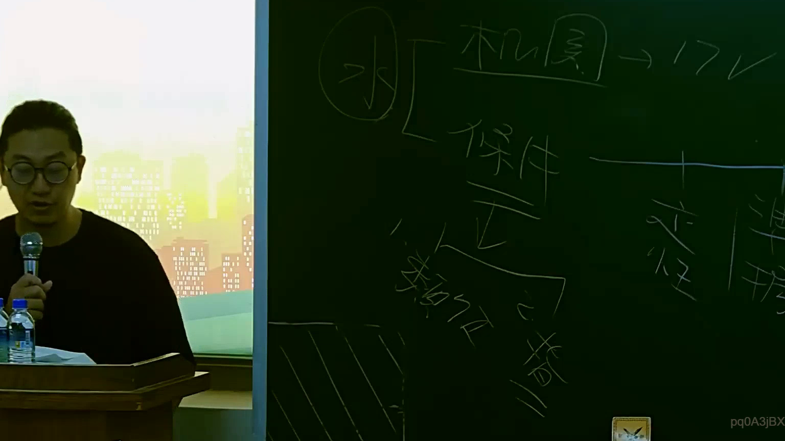

# 🎥 影音教材板書校對筆記
    - **來源影片**: [預約 15 2025-07-24 23-56-40-135](file:///J:/行政法A/ch15/預約 15 2025-07-24 23-56-40-135.mp4)
    - **課程分類**: `[行政法A`
    - **課堂章節**: `ch15]`
    - **影片時間戳記**: `00:37:45` (2265 秒)
    - **板書類型**: `影音板書`
    - **偵測時間**: 2026-07-22 06:13:43
    
    ## 🔍 擷取黑板板書對照圖
    
    
    ## 🧠 AI 智慧理解與知識庫演化註記
    ：
1. 【板書高精度 OCR】：
根據圖片辨識，板書內容主要包含以下文字與結構：
- 圈選字：「水」
- 分支 1：「桃園 -> 17V」
- 分支 2：「保件」
- 下方核心概念：「正」
- 對應或引申文字：「修正」、「指摘」、「類別」等。

2. 【板書詳細解讀與法條對照】：
本板書主要呈現行政法或訴願、行政訴訟實務中的案件分類、管轄機關（如桃園）與案號/文號（如 17V）之對應關係，並涉及對行政處分或保件的「修正」與「指摘」等救濟程序。在臺灣現行法制中，這類板書常見於行政救濟法（如訴願法第14條、行政訴訟法第4條撤銷訴訟）或公法上權利救濟的實務操作解析，用以釐清人民對行政機關處分不服時的管轄歸屬與爭點指摘方向。
    
    ## 📊 可編輯之 Mermaid 關係流程圖
    ```mermaid
    ：
graph TD
    A["水"] --> B["桃園"]
    B --> C["17V"]
    A --> D["保件"]
    D --> E["修正"]
    E --> F["指摘"]
    E --> G["類別"]
    ```
    
    ## ✍️ 操作者手動校對修改區
    <!-- 您可以直接修改上方的文字或調整 Mermaid 區塊中的節點，Obsidian 會即時重新渲染 -->
    - [ ] 欄位結構與法律邏輯已校對無誤。
    - **校對筆記**: 
    