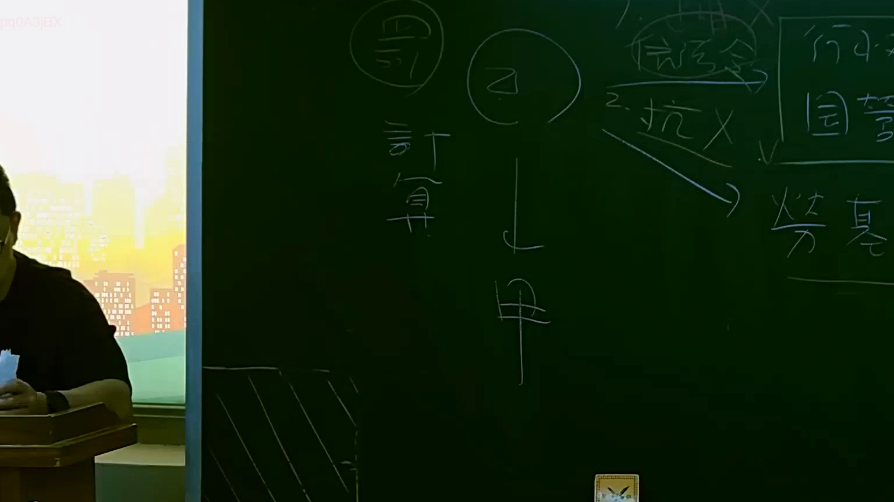

# 🎥 影音教材板書校對筆記
    - **來源影片**: [預約 15 2025-07-24 23-56-40-135](file:///J:/行政法A/ch15/預約 15 2025-07-24 23-56-40-135.mp4)
    - **課程分類**: `[行政法A`
    - **課堂章節**: `ch15]`
    - **影片時間戳記**: `00:53:45` (3225 秒)
    - **板書類型**: `影音板書`
    - **偵測時間**: 2026-07-22 06:13:53
    
    ## 🔍 擷取黑板板書對照圖
    
    
    ## 🧠 AI 智慧理解與知識庫演化註記
    ：
1. 【板書高精度 OCR】：
   圖片中辨識出的文字與符號包含：
   - 左側：圓圈包覆的「罰」字，下方寫有「計算」。
   - 中央主體：圓圈包覆的「乙」，下方經由箭頭指向「甲」（乙 -> 甲）。
   - 右側部分：包含「1. 信託金」、「2. 抗 X」、「國營」、「勞基」等相關法律關鍵字。

2. 【板書詳細解讀與法條對照】：
   - 本板書主要呈現法律主體之間的責任歸屬或給付請求關係（中央的「乙」與「甲」之互動），可能涉及勞動基準法（勞基）、國營事業相關規範、信託法（信託金）或公法與私法交錯之請求權競合。
   - 左側的「罰 / 計算」反映出行政罰、違約金或損害賠償額之計算方法與數額認定。
   - 右側的「抗 X」代表抗辯權之主張與排除（如消滅時效抗辯、同時履行抗辯等）。
   - 對應臺灣現行法規，常見於民法第184條（侵權行為）、勞動基準法相關給付義務，以及行政法上的裁罰計算與救濟。
    
    ## 📊 可編輯之 Mermaid 關係流程圖
    ```mermaid
    ：
graph TD
    A["乙"] -->|請求權/給付關係| B["甲"]
    C["罰"] --> D["計算"]
    E["信託金"] --> F["抗辯 X"]
    G["國營"] --> H["勞基"]
    ```
    
    ## ✍️ 操作者手動校對修改區
    <!-- 您可以直接修改上方的文字或調整 Mermaid 區塊中的節點，Obsidian 會即時重新渲染 -->
    - [ ] 欄位結構與法律邏輯已校對無誤。
    - **校對筆記**: 
    