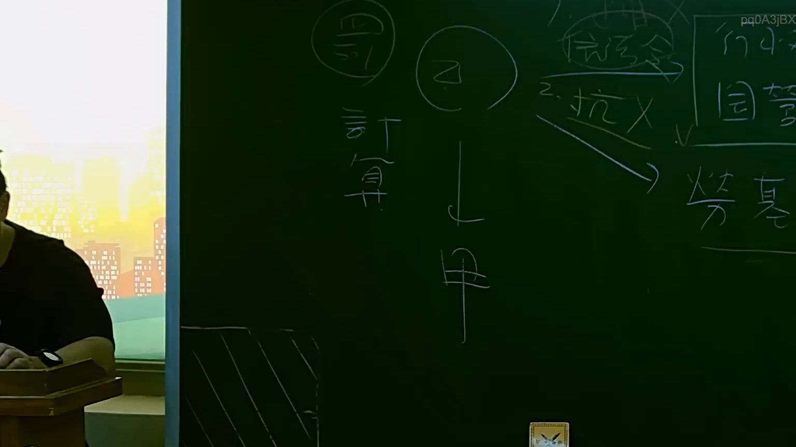

# 🎥 影音教材板書校對筆記
    - **來源影片**: [預約 15 2025-07-24 23-56-40-135](file:///J:/行政法A/ch15/預約 15 2025-07-24 23-56-40-135.mp4)
    - **課程分類**: `[行政法A`
    - **課堂章節**: `ch15]`
    - **影片時間戳記**: `00:55:45` (3345 秒)
    - **板書類型**: `影音板書`
    - **偵測時間**: 2026-07-22 06:14:05
    
    ## 🔍 擷取黑板板書對照圖
    
    
    ## 🧠 AI 智慧理解與知識庫演化註記
    ：
1. 板書高精度 OCR 辨識內容：
   - 畫面中央與左側：包含「乙」、「甲」、「計算」、「罰」等字樣，並以箭頭指出甲、乙之間的法律關係或責任歸屬計算。
   - 右側部分：隱約可見「信託」、「2. 抗X」、「行小」、「國賠」、「勞基」等法律專有名詞與爭點結構。
2. 法律學理與法條對照：
   - 本板書主要呈現公法或勞動法領域中的責任體系與請求權基礎對照，常見於國家賠償法、勞動基準法或行政法之綜合案例題解析。
   - 牽涉到的我國現行法條包含《國家賠償法》（如公務員故意過失不法侵害人民自由權利之國賠責任）、《勞動基準法》（勞基法相關權利義務計算與抗辯事由），以及民事責任與行政罰之競合或計算（對應板書中的「罰」、「計算」）。
   - 透過箭頭與結構化板書，老師正在引導學生釐清多方主體（如甲、乙）之間的請求權競合、抗辯權主張（如抗X），以及最終金額或責任範圍的計算方式。
    
    ## 📊 可編輯之 Mermaid 關係流程圖
    ```mermaid
    ：
graph TD
    A["乙"] -->|責任歸屬與請求權| B["甲"]
    C["計算"] --> D["罰"]
    E["信託"] --> F["抗辯"]
    G["國賠 / 勞基"] --> H["責任與給付計算"]
    ```
    
    ## ✍️ 操作者手動校對修改區
    <!-- 您可以直接修改上方的文字或調整 Mermaid 區塊中的節點，Obsidian 會即時重新渲染 -->
    - [ ] 欄位結構與法律邏輯已校對無誤。
    - **校對筆記**: 
    