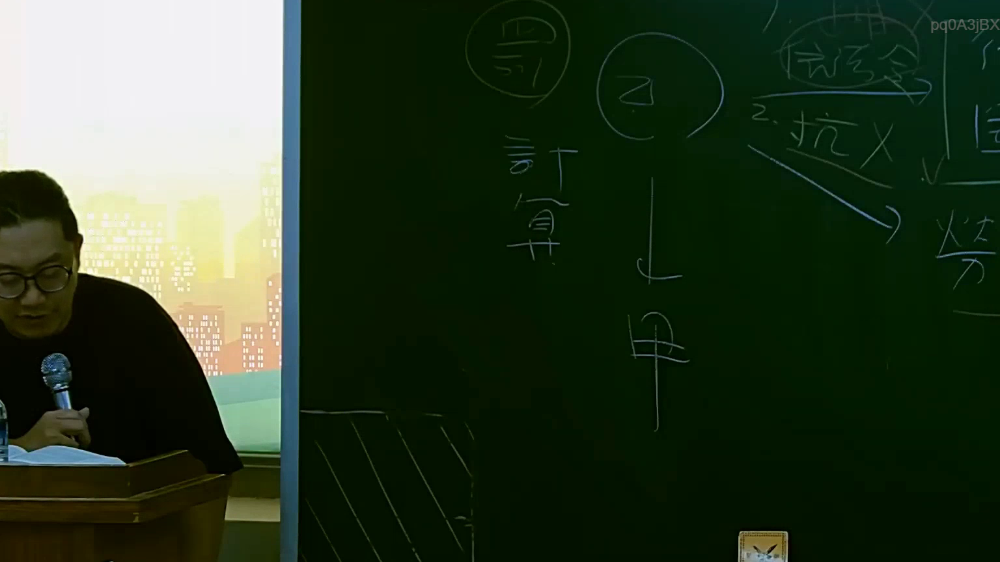

# 🎥 影音教材板書校對筆記
    - **來源影片**: [預約 15 2025-07-24 23-56-40-135](file:///J:/行政法A/ch15/預約 15 2025-07-24 23-56-40-135.mp4)
    - **課程分類**: `[行政法A`
    - **課堂章節**: `ch15]`
    - **影片時間戳記**: `00:57:30` (3450 秒)
    - **板書類型**: `影音板書`
    - **偵測時間**: 2026-07-22 06:14:15
    
    ## 🔍 擷取黑板板書對照圖
    
    
    ## 🧠 AI 智慧理解與知識庫演化註記
    ：
1. 【板書高精度 OCR】：
   - 畫面中央上方有被圓圈包圍的「乙」，下方有「甲」，兩者之間以向下箭頭相連（乙 ➔ 甲）。
   - 左側寫有「罰」、「計算」。
   - 右上方寫有「1. 訴訟」、「2. 抗X（打叉）」、「V」、「3. ⋯⋯（部分被遮擋）」、「勞動」等法律訴訟或實務操作相關文字。

2. 【詳細法律學理與法條對照】：
   - 該板書主要在探討民事訴訟或行政訴訟中的當事人結構（乙與甲之間的法律關係、訴訟程序或求償計算）。
   - 涉及臺灣《民事訴訟法》關於原告與被告之當事人適格、請求權基礎（如民法第184條侵權行為損害賠償、債務不履行損害賠償之計算）、以及抗辯權之行使（如消滅時效抗辯、同時履行抗辯）。
   - 右側的「1. 訴訟」、「2. 抗X」顯示老師正在講解訴訟上的防禦方法、抗辯與訴訟標的之處理邏輯。
    
    ## 📊 可編輯之 Mermaid 關係流程圖
    ```mermaid
    ：
graph TD
    A["乙"] -->|請求/責任| B["甲"]
    C["計算"] --> D["損害賠償金額"]
    E["訴訟程序"] --> F["抗辯"]
    ```
    
    ## ✍️ 操作者手動校對修改區
    <!-- 您可以直接修改上方的文字或調整 Mermaid 區塊中的節點，Obsidian 會即時重新渲染 -->
    - [ ] 欄位結構與法律邏輯已校對無誤。
    - **校對筆記**: 
    