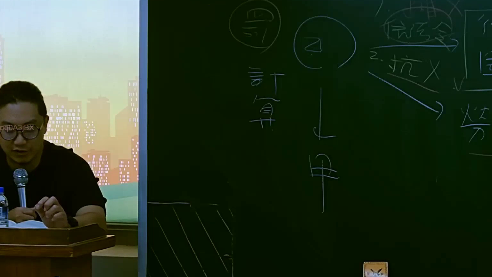

# 🎥 影音教材板書校對筆記
    - **來源影片**: [預約 15 2025-07-24 23-56-40-135](file:///J:/行政法A/ch15/預約 15 2025-07-24 23-56-40-135.mp4)
    - **課程分類**: `[行政法A`
    - **課堂章節**: `ch15]`
    - **影片時間戳記**: `00:58:30` (3510 秒)
    - **板書類型**: `影音板書`
    - **偵測時間**: 2026-07-22 06:14:22
    
    ## 🔍 擷取黑板板書對照圖
    
    
    ## 🧠 AI 智慧理解與知識庫演化註記
    ：
1. 【板書辨識文字】：
   - 畫面左上方圓圈內為：「罰」或相關代稱，下方寫著：「計算」
   - 中間上方圓圈內為：「乙」，下方箭頭指向下方圓圈內的：「甲」
   - 右上方寫著：「1. ... 2. 抗(X) ...」及其他法律抗辯、請求權基礎或主辦機關/相對人之關聯指引（含「信託」、「勞力」等字樣部分殘影）。
2. 【法律學理與爭點對照】：
   - 本板書呈現典型的民事法、行政法或勞動法中主體間的責任歸屬、請求權基礎（如民法第184條侵權行為、行政罰法相關責任歸屬，或勞資爭議中的給付與抗辯）。
   - 藉由「乙」指向「甲」的箭頭及「計算」與「抗辯（X）」的架構，老師正在解析權利義務主體間的求償關係、責任分擔或抗辯權的阻斷（如權利濫用、消滅時效或法定阻卻違法事由不成立）。
    
    ## 📊 可編輯之 Mermaid 關係流程圖
    ```mermaid
    ：
graph TD
    A["乙"] --> B["甲"]
    C["計算"] --> A
    D["抗辯 (X)"] --> B
    ```
    
    ## ✍️ 操作者手動校對修改區
    <!-- 您可以直接修改上方的文字或調整 Mermaid 區塊中的節點，Obsidian 會即時重新渲染 -->
    - [ ] 欄位結構與法律邏輯已校對無誤。
    - **校對筆記**: 
    