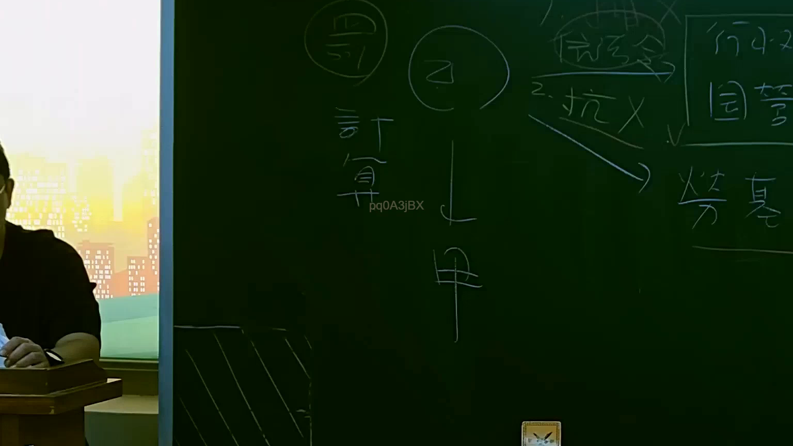

# 🎥 影音教材板書校對筆記
    - **來源影片**: [預約 15 2025-07-24 23-56-40-135](file:///J:/行政法A/ch15/預約 15 2025-07-24 23-56-40-135.mp4)
    - **課程分類**: `[行政法A`
    - **課堂章節**: `ch15]`
    - **影片時間戳記**: `01:07:00` (4020 秒)
    - **板書類型**: `影音板書`
    - **偵測時間**: 2026-07-22 06:14:33
    
    ## 🔍 擷取黑板板書對照圖
    
    
    ## 🧠 AI 智慧理解與知識庫演化註記
    ：
1. 板書高精度 OCR 辨識文字：
   - 畫面中央與左側主要呈現人物關係與計算路徑：「乙」（上方圓圈內）、「甲」（下方）並以向下箭頭串接，左側寫有「計算」及上方帶圓圈的「罰」。
   - 右側板書區塊包含：上方「信託金」、下方「2.抗X」（打叉與打勾符號）、右上方「行政國賠」、右下方「勞基」等相關法律領域或抗辯事由的關鍵字。

2. 法律學理與法條對照：
   - 本板書主要在探討公法與私法交錯之法律關係、行政罰與國家賠償、勞基法相關權利義務，或是公法上請求權與私法請求權之競合與計算。
   - 涉及之臺灣現行法律包括：
     - 《國家賠償法》第2條、第9條（公務員違法侵害人民權利之國家賠償責任）。
     - 《行政罰法》相關裁罰與計算規定。
     - 《勞動基準法》（勞基）相關勞動權益與給付計算。
     - 《信託法》有關信託財產之獨立性與信託金之法律關係。
    
    ## 📊 可編輯之 Mermaid 關係流程圖
    ```mermaid
    ：
graph TD
    A["乙"] -->|"侵害/指揮/給付"| B["甲"]
    C["罰"] --> A
    D["計算"] --> A
    E["信託金"] --> F["抗辯/行政國賠"]
    F --> G["勞基"]
    ```
    
    ## ✍️ 操作者手動校對修改區
    <!-- 您可以直接修改上方的文字或調整 Mermaid 區塊中的節點，Obsidian 會即時重新渲染 -->
    - [ ] 欄位結構與法律邏輯已校對無誤。
    - **校對筆記**: 
    