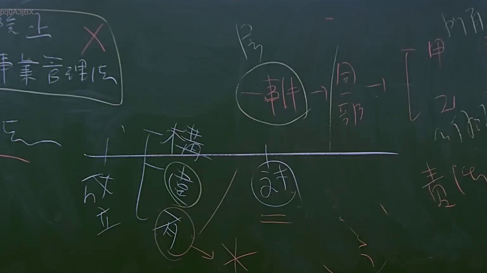

# 🎥 影音教材板書校對筆記
    - **來源影片**: [預約 15 2025-07-24 23-56-40-135](file:///J:/行政法A/ch15/預約 15 2025-07-24 23-56-40-135.mp4)
    - **課程分類**: `[行政法A`
    - **課堂章節**: `ch15]`
    - **影片時間戳記**: `01:09:00` (4140 秒)
    - **板書類型**: `影音板書`
    - **偵測時間**: 2026-07-22 06:14:43
    
    ## 🔍 擷取黑板板書對照圖
    
    
    ## 🧠 AI 智慧理解與知識庫演化註記
    ：
本板書主要在探討臺灣民法中關於請求權基礎或契約責任與侵權責任競合、或關於「一事不再理」與請求權一部請求之相關法理概念。
1. 板書文字辨識：
   - 左上角：「廢止」、「事業管理法」、「X」
   - 中間上方：「房」、「一事」、「全部」
   - 右側：「甲」、「乙」、「責任」
   - 中間時間軸或階層區分：「成立」、「構」、「效」、「有」、「訴」、「二」
2. 法律學理與條文對位：
   - 涉及民法請求權之「一部請求」與「全部請求」之訴訟法上爭點。當原告（如甲）就同一債之本旨或同一侵權事實提起一部請求時，其既判力及於起訴之範圍（一部或全部），實務與學說常討論是否構成民事訴訟法上之「一事不再理」或起訴合法性問題。
   - 相關條文對照：民法第 184 條（侵權行為責任）、民法第 227 條（不完全給付）、民事訴訟法第 249 條、第 400 條（既判力範圍）。
    
    ## 📊 可編輯之 Mermaid 關係流程圖
    ```mermaid
    ：
graph TD
    A["甲"] -->|"主張"| B["責任"]
    C["一事"] -->|"延伸"| D["全部"]
    E["成立"] --> F["構"]
    E --> G["效"]
    G --> H["訴"]
    ```
    
    ## ✍️ 操作者手動校對修改區
    <!-- 您可以直接修改上方的文字或調整 Mermaid 區塊中的節點，Obsidian 會即時重新渲染 -->
    - [ ] 欄位結構與法律邏輯已校對無誤。
    - **校對筆記**: 
    