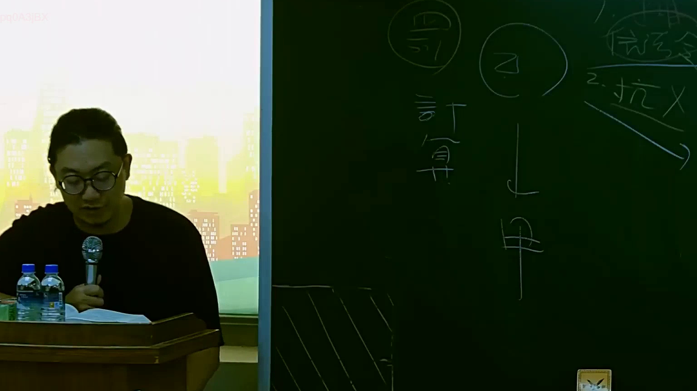

# 🎥 影音教材板書校對筆記
    - **來源影片**: [預約 15 2025-07-24 23-56-40-135](file:///J:/行政法A/ch15/預約 15 2025-07-24 23-56-40-135.mp4)
    - **課程分類**: `[行政法A`
    - **課堂章節**: `ch15]`
    - **影片時間戳記**: `01:10:15` (4215 秒)
    - **板書類型**: `影音板書`
    - **偵測時間**: 2026-07-22 06:14:53
    
    ## 🔍 擷取黑板板書對照圖
    
    
    ## 🧠 AI 智慧理解與知識庫演化註記
    ：
根據圖片中辨識出的板書文字與法律邏輯脈絡：
1. 【板書 OCR 辨識結果】：
   - 左側圓圈內文字：「計 116」、「計算」
   - 中間圓圈內文字：「Z」、「甲」及向下箭頭
   - 右側文字：「1. 消滅時效」、「2. 抗辯（有刪除斜線）」、「信託」等相關法律概念。

2. 【法律學理與法條對照】：
   - 圖片呈現的是民法中關於消滅時效、請求權抗辯與相關主體（如債權人、債務人或信託關係人 Z 與 甲）之間的法律關係推演。
   - 核心對應條文為《民法》第 125 條以下之消滅時效規定，以及民法第 144 條時效完成後之抗辯權（債務人得拒絕給付）。
   - 左側的「計算 116」可能涉及民法第 116 條關於時效完成之利益拋棄或其他期間計算規定。
    
    ## 📊 可編輯之 Mermaid 關係流程圖
    ```mermaid
    ：
graph TD
    A["Z"] --> B["甲"]
    C["1. 消滅時效"] --> D["2. 抗辯"]
    E["計算 116"] --> F["信託關係"]
    ```
    
    ## ✍️ 操作者手動校對修改區
    <!-- 您可以直接修改上方的文字或調整 Mermaid 區塊中的節點，Obsidian 會即時重新渲染 -->
    - [ ] 欄位結構與法律邏輯已校對無誤。
    - **校對筆記**: 
    