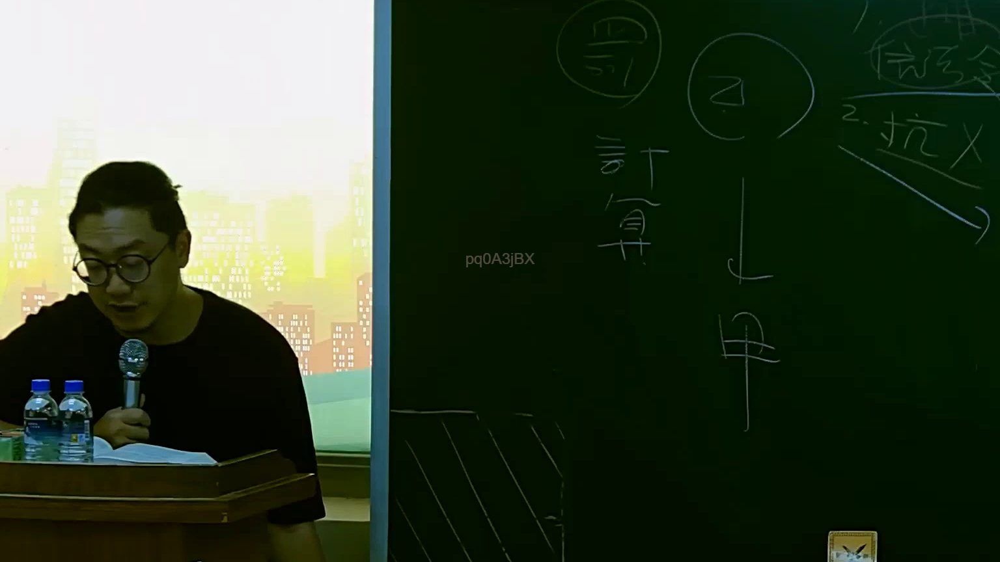

# 🎥 影音教材板書校對筆記
    - **來源影片**: [預約 15 2025-07-24 23-56-40-135](file:///J:/行政法A/ch15/預約 15 2025-07-24 23-56-40-135.mp4)
    - **課程分類**: `[行政法A`
    - **課堂章節**: `ch15]`
    - **影片時間戳記**: `01:11:15` (4275 秒)
    - **板書類型**: `影音板書`
    - **偵測時間**: 2026-07-22 06:15:03
    
    ## 🔍 擷取黑板板書對照圖
    
    
    ## 🧠 AI 智慧理解與知識庫演化註記
    ：
1. 板書高精度 OCR 辨識內容：
   - 畫面左上方圓圈內：有「116」或「117」等字樣（民法關於意思表示不真實或錯誤之撤銷條文，如民法第88條、第116條等脈絡）。
   - 畫面左下方直行文字：「計算」。
   - 畫面中央上方圓圈內：文字為「乙」。
   - 畫面中央下方：文字為「甲」，中間有向下箭頭連接乙與甲。
   - 畫面右上方文字：「1. ... 信賴令...」、「2. 抗X」（可能涉及民法信賴保護、意思表示錯誤之撤銷限制或抗辯）。

2. 詳細法律學理與法條對照：
   - 本板書主要探討民法總則編中關於「意思表示錯誤」之撤銷及其法律效果，特別是民法第88條（意思表示錯誤之撤銷）、第114條（法律行為之撤銷效力，自始失效）與第116條（撤銷之意思表示）。
   - 當事人甲、乙之間可能因意思表示錯誤成立法律行為，隨後涉及撤銷權之行使（如民法第116條規定撤銷應向相對人為之，故由乙或甲發動），並延伸至損害賠償責任（民法第91條：錯誤表意人之賠償責任）或消滅時效、抗辯權之問題。
    
    ## 📊 可編輯之 Mermaid 關係流程圖
    ```mermaid
    ：
graph TD
    A["乙"] -->|"撤銷意思表示 / 法律行為"| B["甲"]
    C["民法第116條"] -->|"撤銷權行使"| A
    D["民法第88條 / 第91條"] -->|"錯誤與信賴賠償"| B
    ```
    
    ## ✍️ 操作者手動校對修改區
    <!-- 您可以直接修改上方的文字或調整 Mermaid 區塊中的節點，Obsidian 會即時重新渲染 -->
    - [ ] 欄位結構與法律邏輯已校對無誤。
    - **校對筆記**: 
    