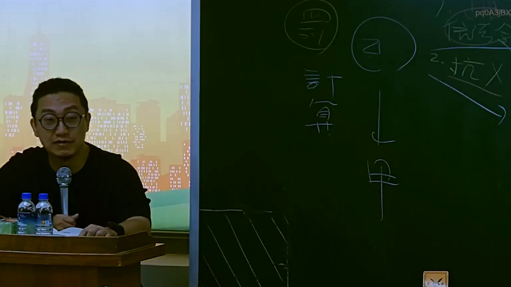

# 🎥 影音教材板書校對筆記
    - **來源影片**: [預約 15 2025-07-24 23-56-40-135](file:///J:/行政法A/ch15/預約 15 2025-07-24 23-56-40-135.mp4)
    - **課程分類**: `[行政法A`
    - **課堂章節**: `ch15]`
    - **影片時間戳記**: `01:19:30` (4770 秒)
    - **板書類型**: `影音板書`
    - **偵測時間**: 2026-07-22 06:15:12
    
    ## 🔍 擷取黑板板書對照圖
    
    
    ## 🧠 AI 智慧理解與知識庫演化註記
    ：
根據圖片中的板書內容與臺灣民法學理，本板書主要在探討關於民法上的責任計算、抗辯以及主體間的法律關係。
1. 板書文字辨識：
   - 左側圓圈內文字：「得」、「計算」
   - 中間圓圈內文字：「乙」，下方箭頭指向「甲」
   - 右側文字：「2. 抗（打叉）」以及上方模糊的「信託」等字樣。
2. 法律學理與法條對照：
   - 本圖呈現的是民法上請求權或抗辯權的行使與計算邏輯（例如民法第198條關於侵權行為時效抗辯、或不當得利返還請求權之計算），涉及當事人主體（甲、乙）之間的權利義務交織與抗辯（Exception）。
   - 當一方主張抗辯權（如時效抗辯、同時履行抗辯等）時，另一方所得請求之金額或範圍須透過「計算」來釐清。
    
    ## 📊 可編輯之 Mermaid 關係流程圖
    ```mermaid
    ：
graph TD
    A["乙"] -->|「計算 / 得」| B["甲"]
    C["2. 抗辯"] -.->|排除或限制| A
    ```
    
    ## ✍️ 操作者手動校對修改區
    <!-- 您可以直接修改上方的文字或調整 Mermaid 區塊中的節點，Obsidian 會即時重新渲染 -->
    - [ ] 欄位結構與法律邏輯已校對無誤。
    - **校對筆記**: 
    