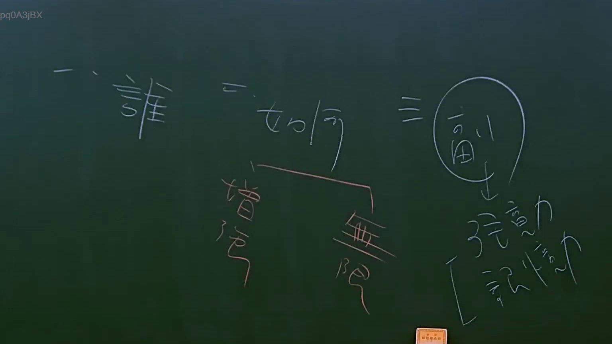

# 🎥 影音教材板書校對筆記
    - **來源影片**: [預約 15 2025-07-24 23-56-40-135](file:///J:/行政法A/ch15/預約 15 2025-07-24 23-56-40-135.mp4)
    - **課程分類**: `[行政法A`
    - **課堂章節**: `ch15]`
    - **影片時間戳記**: `01:23:45` (5025 秒)
    - **板書類型**: `影音板書`
    - **偵測時間**: 2026-07-22 06:16:16
    
    ## 🔍 擷取黑板板書對照圖
    
    
    ## 🧠 AI 智慧理解與知識庫演化註記
    ：

### 一、板書高精度 OCR 識別
本幅板書由老師手書，結構清晰，分為三個主要部分與分支：
1. **左側**：「一．誰」
2. **中間**：「二．如何」
   - 向下分支出兩個概念：「增強」、「無限」
3. **右側**：「三．(副)」（「副」字外圈有圓圈標記）
   - 向下以箭頭指向兩個學習或論證特質：「張力」、「[ 記憶力」

---

### 二、法律學理、爭點與案例邏輯解說

本板書呈現的是一套**「法律問題分析方法論」**與**「法科學習／申論撰寫策略」**的雙重邏輯：

#### 1. 法律關係的分析路徑（案例事實解析）
* **「一．誰」—— 主體之確定（當事人）**
  * 在民事法中，分析案例的首要步驟是「尋找當事人」（請求權主體與相對人）。
  * **法條對照**：民法第6條（自然人權利能力）、第25條（法人）。在案例中，必須先確認「誰向誰（Who to whom）」主張權利，才能依據民法第199條規定建立債權債務關係。
* **「二．如何」—— 請求權基礎與論證方法（增強與無限）**
  * **增強**：指「論證說服力的強化」。在寫作法律申論題或法庭攻防時，如何透過通說、實務見解（如最高法院大法庭裁定）來增強自身主張的力道。例如在民法第184條第1項前段侵權行為中，如何論證「權利」受侵害而非僅是純粹經濟上損失。
  * **無限**：指「防範法律責任或論點的無限上綱」。在責任歸屬上，需區分「有限責任」與「無限責任」（例如民法第681條合夥人之連帶無限清償責任）。在申論寫作上，則是指論述必須聚焦，不可無限蔓延、失焦。
* **「三．(副)」—— 附隨效果與論證張力（張力與記憶力）**
  * **法理聯想（主給付與附隨義務）**：在民法債之關係中，除了主要給付義務外，尚有「從給付義務」與「附隨義務」（民法第224條、第227條不完全給付之延伸學理）。
  * 板書中的「副」對應到學習與寫作，是指透過體系化的架構，不僅能掌握核心分數，還能產生**「副學習（Concomitant Learning）」**的效果。
  * **張力**：邏輯推論的嚴密性與文字張力。
  * **記憶力**：透過體系表（如本板書）的建立，能大幅增強法條與學說的記憶提取效率。

---
    
    ## 📊 可編輯之 Mermaid 關係流程圖
    ```mermaid
    ：
graph TD
    Root["法律分析與學習架構"] --> Node1["一．誰 (主體確定)"]
    Root["法律分析與學習架構"] --> Node2["二．如何 (論證方法)"]
    Root["法律分析與學習架構"] --> Node3["三．副 (附隨效果)"]

    Node1 --> Sub1["民法當事人/權利主體 (民法§6, §25)"]
    
    Node2 --> Sub2_1["增強 (說服力/實務見解強化)"]
    Node2 --> Sub2_2["無限 (聚焦核心/責任界限)"]
    
    Node3 --> Sub3_1["張力 (論述嚴密性)"]
    Node3 --> Sub3_2["記憶力 (法條與體系提取)"]

    style Node1 fill#f9f,stroke#333,stroke-width2px
    style Node2 fill#bbf,stroke#333,stroke-width2px
    style Node3 fill#fb1,stroke#333,stroke-width2px
    ```
    
    ## ✍️ 操作者手動校對修改區
    <!-- 您可以直接修改上方的文字或調整 Mermaid 區塊中的節點，Obsidian 會即時重新渲染 -->
    - [ ] 欄位結構與法律邏輯已校對無誤。
    - **校對筆記**: 
    