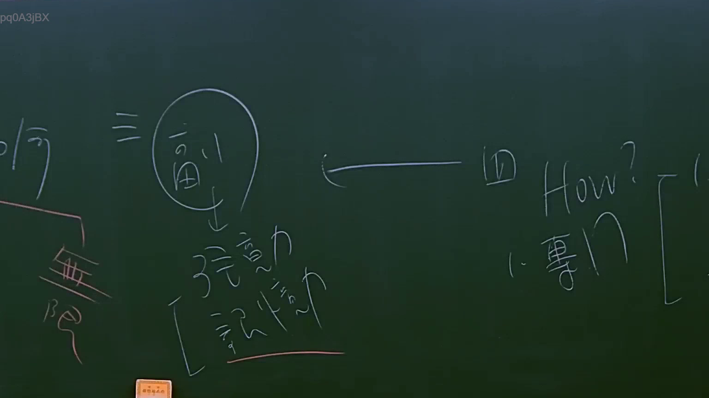

# 🎥 影音教材板書校對筆記
    - **來源影片**: [預約 15 2025-07-24 23-56-40-135](file:///J:/行政法A/ch15/預約 15 2025-07-24 23-56-40-135.mp4)
    - **課程分類**: `[行政法A`
    - **課堂章節**: `ch15]`
    - **影片時間戳記**: `01:26:15` (5175 秒)
    - **板書類型**: `影音板書`
    - **偵測時間**: 2026-07-22 06:16:51
    
    ## 🔍 擷取黑板板書對照圖
    
    
    ## 🧠 AI 智慧理解與知識庫演化註記
    ：

**一、 板書高精度 OCR 辨識**
1. **左側區塊**：
   - 寫有「何」（如何判定行為資格）。
   - 下方以粉色筆劃分出「無」（無行為能力）與「限」（限制行為能力）。
2. **中央區塊**：
   - 標記有「三」並指向一個被圈起來的「測」字（代表對「意思能力」的檢測、測量或認定）。
   - 「測」字下方拉出箭頭指向兩個核心概念：「意思力」與「認知力」，並以大括號「 [ 」加以括合。
3. **右側區塊**：
   - 標記有「㈣」，並有一條長箭頭向左指向中央的「測」字。
   - 右方寫有「How?」（如何進行檢測？），並拉出「1. 專門 [ 」（指需要由專門或專業機構進行鑑定）。

---

**二、 法律學理與現行法條對照解析**

本板書的核心在於剖析台灣民法中**「行為能力（法定資格）」**與**「意思能力（事實狀態）」**的區辨，以及在訴訟實務上如何「檢測」意思能力。

1. **「行為能力」的法定化與定型化（左側「無」、「限」）**
   - **學理說明**：行為能力是指能獨立為有效法律行為的資格。為了保護交易安全，法律採取「定型化（外觀化）」的硬性標準，主要以「年齡」及「是否受監護/輔助宣告」為斷。
   - **條文對照**：
     - **民法第13條**：規定「無行為能力人」（未滿7歲）與「限制行為能力人」（7歲以上未滿18歲）。
     - **民法第75條前段**：無行為能力人之意思表示，無效。

2. **「意思能力」的實質要素（中央「意思力」、「認知力」）**
   - **學理說明**：意思能力是指行為人於「行為當時」，對於自己行為之法律效果是否具有正常的理解、辨識與自主決定的精神能力。它包含兩個層面：
     - **認知力**：對事物利害得失的認識、判斷力（理解行為之意義與後果）。
     - **意思力**：依其認知而自由決定其意志並控制自己行為的能力（意志自由）。
   - **條文對照**：
     - **民法第75條後段**：雖非無行為能力人，而其意思表示，係在「無意識或精神錯亂中」所為者亦同（亦為無效）。此處的「無意識或精神錯亂」，在學理上即指欠缺「意思能力」。

3. **實務爭點：意思能力如何認定與檢測（右側「㈣ ──> 測 (How? 1. 專門)」）**
   - **法律爭點**：意思能力是個案發生時的「事實問題」，而非如行為能力般有明確的年齡標準。當事人是否在「無意識或精神錯亂中」為意思表示，事後極難舉證。
   - **檢測方式（How?）**：
     - 法院在個案審理中，無法單憑法官的主觀直覺來判斷當事人行為時有無「意思力」與「認知力」。
     - 必須仰賴**「1. 專門」**（即醫學、精神醫學等專業領域之鑑定人）進行司法精神鑑定，透過過往病歷、行為表現及專業診斷，回溯評估其行為時的意識狀態。
   - **條文對照**：
     - **民事訴訟法第324條**：「鑑定，由法院選任鑑定人命其陳述意見。」在確認民法第75條後段意思能力欠缺的訴訟中，法院高度仰賴此一專門鑑定程序。
    
    ## 📊 可編輯之 Mermaid 關係流程圖
    ```mermaid
    ：
graph TD
    A["法律上的行為資格"] --> B["行為能力<br>(法定/定型化標準)"]
    A --> C["意思能力<br>(個案事實狀態)"]

    B --> B1["判定依據 (何)"]
    B1 --> B2["無行為能力<br>(如未滿7歲、受監護宣告)"]
    B1 --> B3["限制行為能力<br>(如7-18歲)"]

    C --> C1["兩大核心要素"]
    C1 --> C2["意思力<br>(自主控制與決定意志)"]
    C1 --> C3["認知力<br>(對行為後果之理解判斷)"]

    C --> D["實務認定與檢測 (測)"]
    D --> D1["如何判定？ (How?)"]
    D1 --> D2["1. 專門鑑定<br>(精神醫學/司法鑑定)"]

    B2 -.-> E["民法第75條前段<br>(意思表示無效)"]
    C2 & C3 -.-> F["欠缺者"]
    F --> G["民法第75條後段<br>(無意識或精神錯亂，亦無效)"]
    G -.-> D2
    ```
    
    ## ✍️ 操作者手動校對修改區
    <!-- 您可以直接修改上方的文字或調整 Mermaid 區塊中的節點，Obsidian 會即時重新渲染 -->
    - [ ] 欄位結構與法律邏輯已校對無誤。
    - **校對筆記**: 
    