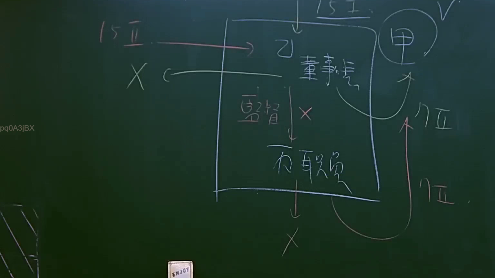

# 🎥 影音教材板書校對筆記
    - **來源影片**: [預約 15 2025-07-24 23-56-40-135](file:///J:/行政法A/ch15/預約 15 2025-07-24 23-56-40-135.mp4)
    - **課程分類**: `[行政法A`
    - **課堂章節**: `ch15]`
    - **影片時間戳記**: `01:46:45` (6405 秒)
    - **板書類型**: `影音板書`
    - **偵測時間**: 2026-07-22 06:16:59
    
    ## 🔍 擷取黑板板書對照圖
    
    
    ## 🧠 AI 智慧理解與知識庫演化註記
    ：

板書內容辨識：
1. 主體架構：矩形方框代表公司組織。
2. 內部成員：「乙 董事長」、「丙 職員」。
3. 關係與標註：
   - 頂部標註「15 I」，內部「監督」箭頭指向「丙 職員」。
   - 左側有「15 II」箭頭指向「乙 董事長」，並標註「X」（可能指無行為能力或不適用）。
   - 右側有「甲」，並有箭頭指向「甲」，標註「17 I」。
   - 右下角有「17 II」。
   - 底部有「X」符號。

法律解讀：
本板書主要探討公司內部責任歸屬及侵權行為之責任分擔，極可能與《民法》第188條「僱用人責任」或公司法相關損害賠償責任有關，但結合「15」、「17」等數字，亦有可能是針對《國家賠償法》或特定行政法律關係的探討。
- 15 I 與 15 II：若參照國家賠償法，第15條通常涉及公務員職務行為之損害賠償。
- 17 I 與 17 II：通常指涉國家賠償法第17條，涉及損害賠償之請求權時效或求償權行使。
- 乙（董事長）與丙（職員）之關係：顯示董事長對職員具有監督義務。若職員（丙）執行職務造成損害，且董事長（乙）監督不周，可能構成賠償責任之主體。
- 甲：通常作為受害人或請求權人之地位。
- 邏輯演化：板書透過「監督」連結，說明職務侵權行為中，主管責任與執行人責任之區別，並透過「17條」引出後續的賠償請求權或求償程序。
    
    ## 📊 可編輯之 Mermaid 關係流程圖
    ```mermaid
    ：

graph TD
    A["外部權源 15 I"] --> B["乙 董事長"]
    B -->|監督| C["丙 職員"]
    C -->|執行職務| D["損害 X"]
    B -.->|不適用 X| E["15 II"]
    C -->|求償/訴訟| F["甲"]
    F -.->|時效/請求權| G["17 I"]
    F -.->|責任歸屬| H["17 II"]
    ```
    
    ## ✍️ 操作者手動校對修改區
    <!-- 您可以直接修改上方的文字或調整 Mermaid 區塊中的節點，Obsidian 會即時重新渲染 -->
    - [ ] 欄位結構與法律邏輯已校對無誤。
    - **校對筆記**: 
    