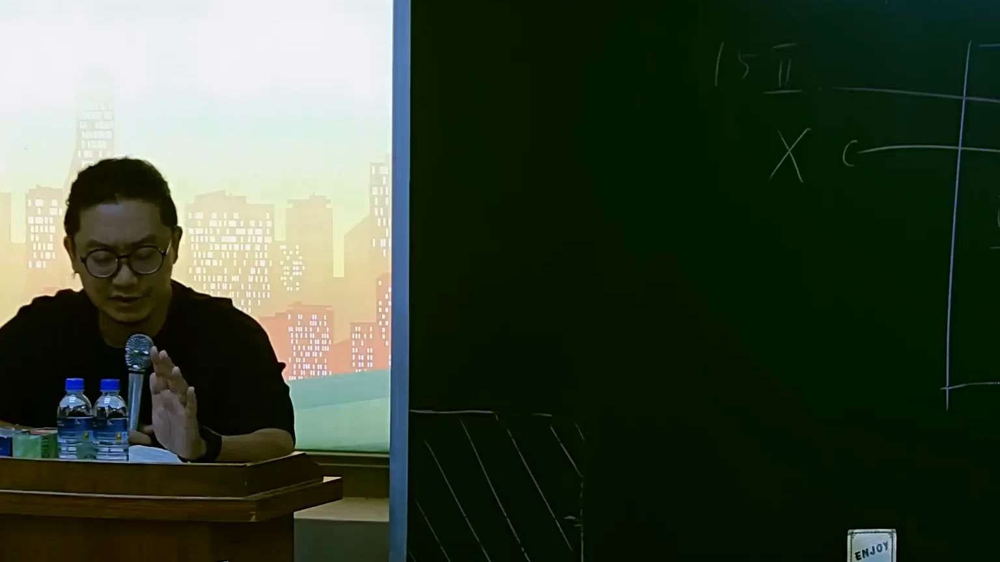

# 🎥 影音教材板書校對筆記
    - **來源影片**: [預約 15 2025-07-24 23-56-40-135](file:///J:/行政法A/ch15/預約 15 2025-07-24 23-56-40-135.mp4)
    - **課程分類**: `[行政法A`
    - **課堂章節**: `ch15]`
    - **影片時間戳記**: `01:47:45` (6465 秒)
    - **板書類型**: `影音板書`
    - **偵測時間**: 2026-07-22 06:17:08
    
    ## 🔍 擷取黑板板書對照圖
    
    
    ## 🧠 AI 智慧理解與知識庫演化註記
    ：

1. 板書內容辨識：
   - 圖片左上角呈現「15 II」。
   - 下方有字母「X」與「c」的關聯箭頭。

2. 法律學理與法條對照：
   - 「15 II」通常指涉民法第15條第2項之規定：「受監護宣告之人，無行為能力。」或針對預約（民法第153條第2項）之法律效果討論。
   - 結合教材標題「預約」與老師講授脈絡，此處板書應是在討論「預約之成立要件與效力」。民法第153條第2項規定：「當事人互相表示意思一致，而對於必要之點，不經表示，而定有不必要之點者，除有反對之意思外，推定其契約為成立。」
   - 「X」與「c」之關係圖，常見於分析契約當事人（當事人X與相對人c）或預約與本約之間的對應關係。在教學語境下，這通常用來解釋預約雖然未標定所有細節，但只要「必要之點」合致，預約即告成立，後續本約的義務可以由預約推導出來。

3. 法律演化註記：
   - 預約之義務內容為「訂立本約之義務」，若當事人一方拒絕履行，他方得請求強制執行訂立本約。
   - 實務上（如最高法院判決）對於預約的判斷，強調是否已具備本約的「必要之點」。若預約僅具雛形，實務多傾向解釋為「預約」而非「本約」本身，以免過度干涉當事人自治。
    
    ## 📊 可編輯之 Mermaid 關係流程圖
    ```mermaid
    ：

graph TD
    A["預約成立 (15 II / 153 II)"] --> B{"必要之點合致"}
    B -->|是| C["當事人 X"]
    B -->|是| D["相對人 c"]
    C <-->|"訂立本約義務"| D
    ```
    
    ## ✍️ 操作者手動校對修改區
    <!-- 您可以直接修改上方的文字或調整 Mermaid 區塊中的節點，Obsidian 會即時重新渲染 -->
    - [ ] 欄位結構與法律邏輯已校對無誤。
    - **校對筆記**: 
    