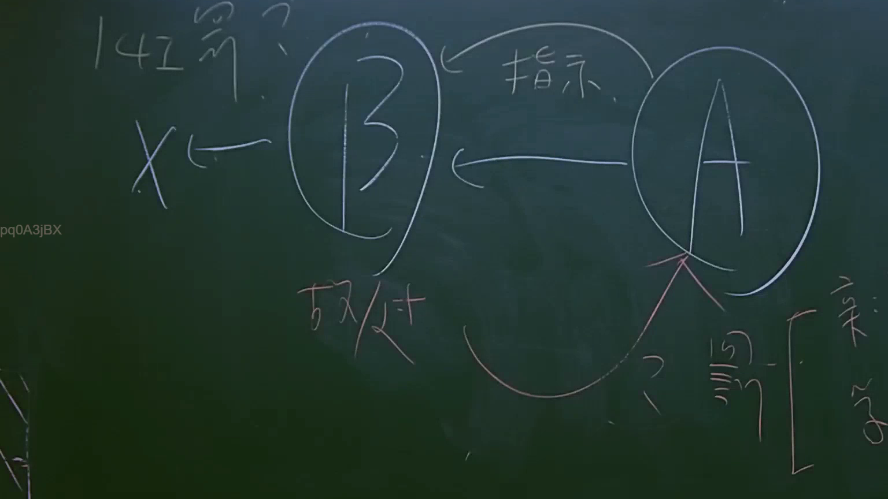

# 🎥 影音教材板書校對筆記
    - **來源影片**: [預約 15 2025-07-24 23-56-40-135](file:///J:/行政法A/ch15/預約 15 2025-07-24 23-56-40-135.mp4)
    - **課程分類**: `[行政法A`
    - **課堂章節**: `ch15]`
    - **影片時間戳記**: `02:08:00` (7680 秒)
    - **板書類型**: `影音板書`
    - **偵測時間**: 2026-07-22 06:17:18
    
    ## 🔍 擷取黑板板書對照圖
    
    
    ## 🧠 AI 智慧理解與知識庫演化註記
    ：
1. 板書文字辨識：
   - 左上角：141號？（推測指涉大法官釋字第141號解釋或相關司法實務見解）
   - 中間核心：A（主體）、B（主體），A 指示 B，B 對 X（標的或第三人）進行行為。
   - B 下方標註：故意/過失。
   - 右下方：？ 契約 [ 法律關係（條款）]。

2. 法律學理與法條對照：
   - 此圖呈現的是「間接侵權」或「指示行為」下的責任歸屬結構，常見於民法第184條侵權行為體系或第188條僱用人責任之探討。
   - 「A 指示 B」：探討的是 A 是否負擔教唆責任或連帶責任。若 A 具備指揮監督地位，且 B 之行為造成損害，則 A 可能負擔民法第188條「僱用人連帶責任」或第185條「共同侵權責任」。
   - 「故意/過失」：係侵權行為要件的核心。B 對 X 造成損害，須具備責任能力與歸責事由。
   - 「141號」：在民事法律框架下，常與「契約責任與侵權責任之競合」或「受託人責任」相關。此處可能討論 A 與 B 之間是否存在契約關係，進而影響對 X 的請求權基礎。
    
    ## 📊 可編輯之 Mermaid 關係流程圖
    ```mermaid
    ：
graph LR
A["主體 A (指示者)"] -- "指示" --> B["主體 B (行為人)"]
A -.-> |"契約關係"| B
B --> |"行為 (故意/過失)"| X["第三人/標的 X"]
B -.-> |"責任歸屬"| A
subgraph "法律關係"
A
B
end
    ```
    
    ## ✍️ 操作者手動校對修改區
    <!-- 您可以直接修改上方的文字或調整 Mermaid 區塊中的節點，Obsidian 會即時重新渲染 -->
    - [ ] 欄位結構與法律邏輯已校對無誤。
    - **校對筆記**: 
    