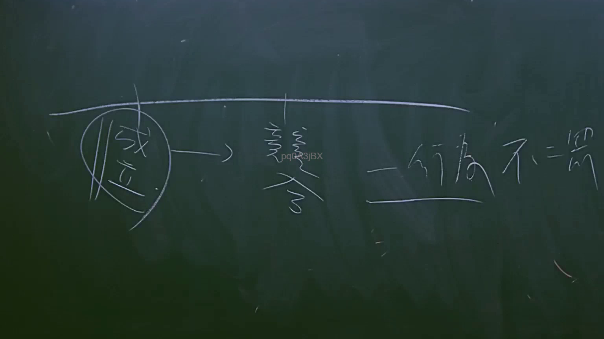

# 🎥 影音教材板書校對筆記
    - **來源影片**: [預約 15 2025-07-24 23-56-40-135](file:///J:/行政法A/ch15/預約 15 2025-07-24 23-56-40-135.mp4)
    - **課程分類**: `[行政法A`
    - **課堂章節**: `ch15]`
    - **影片時間戳記**: `02:11:45` (7905 秒)
    - **板書類型**: `影音板書`
    - **偵測時間**: 2026-07-22 06:17:28
    
    ## 🔍 擷取黑板板書對照圖
    
    
    ## 🧠 AI 智慧理解與知識庫演化註記
    ：
1. 板書文字辨識：
   - 圓圈內文字：「成立」
   - 箭頭後方文字：「變更」、「行為不二罰」

2. 法律學理與爭點分析：
   - 此板書探討行政法領域中關於「行政罰」的核心原則，特別是「一行為不二罰」原則（行政罰法第24條）。
   - 「成立」：指行政機關認定行為人違反行政法義務的事實已具備構成要件，違規行為「成立」。
   - 「變更」：可能指後續行政程序中的裁罰變更，或者是針對數個違規行為進行處罰方式的變更。
   - 「行為不二罰」：這是行政罰的核心原則，規定一行為違反數個行政法上義務而規定處罰者，應從一重處罰。其法理基礎在於避免國家對單一違規行為進行重複處罰，違反比例原則。
   - 聯想條文：行政罰法第24條規定：「一行為違反數個行政法上義務規定而應處罰鍰者，依法定罰鍰額最高之規定裁處。」若涉及數個行政罰的競合，則需判斷是否為「一行為」。

3. 演化註記：
   - 此概念常與刑事法律中的「一事不二罰」（憲法及刑事訴訟法保障）對照。但在行政法中，若一行為同時觸犯刑事法律與行政法規，行政罰法第26條規定應優先適用刑事罰，僅在刑事不罰或經不起訴處分時，行政機關始得再行裁罰。
    
    ## 📊 可編輯之 Mermaid 關係流程圖
    ```mermaid
    ：
graph LR
A["成立"] --> B["變更"]
B --> C["行為不二罰"]
    ```
    
    ## ✍️ 操作者手動校對修改區
    <!-- 您可以直接修改上方的文字或調整 Mermaid 區塊中的節點，Obsidian 會即時重新渲染 -->
    - [ ] 欄位結構與法律邏輯已校對無誤。
    - **校對筆記**: 
    