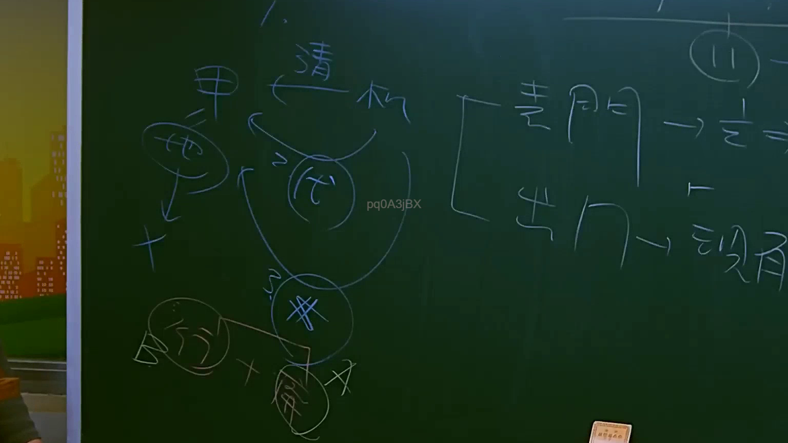

# 🎥 影音教材板書校對筆記
    - **來源影片**: [預約 17 2025-07-25 11-43-57-846](file:///J:/行政法A/ch17/預約 17 2025-07-25 11-43-57-846.mp4)
    - **課程分類**: `[行政法A`
    - **課堂章節**: `ch17]`
    - **影片時間戳記**: `00:21:30` (1290 秒)
    - **板書類型**: `關係圖/邏輯圖板書`
    - **偵測時間**: 2026-07-21 01:35:44
    
    ## 🔍 擷取黑板板書對照圖
    
    
    ## 🧠 AI 智慧理解與知識庫演化註記
    您好，感謝您的提問。不過我注意到您提供的訊息中，**OCR 辨識字元區域為空白**——在「擷取區域的 OCR 辨識字元如下：」之後沒有實際的文字內容。

為了完成以下兩項任務：

1. **語意整理與法律條文比對註記**（如民法第184條、侵權行為、消滅時效等）
2. **生成 Mermaid.js 流程圖代碼**（關係圖/邏輯圖結構）

我需要您補充提供該截圖的 OCR 辨識文字內容。請將板書上的字元貼上，我即可立即為您完成分析與圖表生成。
    
    ## 📊 可編輯之 Mermaid 關係流程圖
    ```mermaid
    graph TD
    A["影音板書"] --> B["尚無關聯關係"]
    ```
    
    ## ✍️ 操作者手動校對修改區
    <!-- 您可以直接修改上方的文字或調整 Mermaid 區塊中的節點，Obsidian 會即時重新渲染 -->
    - [ ] 欄位結構與法律邏輯已校對無誤。
    - **校對筆記**: 
    