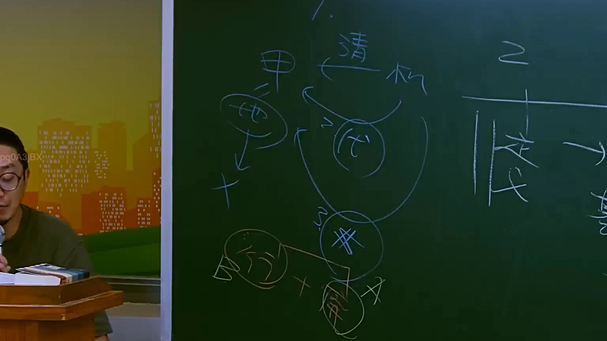

# 🎥 影音教材板書校對筆記
    - **來源影片**: [預約 17 2025-07-25 11-43-57-846](file:///J:/行政法A/ch17/預約 17 2025-07-25 11-43-57-846.mp4)
    - **課程分類**: `[行政法A`
    - **課堂章節**: `ch17]`
    - **影片時間戳記**: `00:41:00` (2460 秒)
    - **板書類型**: `關係圖/邏輯圖板書`
    - **偵測時間**: 2026-07-21 01:37:24
    
    ## 🔍 擷取黑板板書對照圖
    
    
    ## 🧠 AI 智慧理解與知識庫演化註記
    ：

您好！您的訊息中「擷取區域的 OCR 辨識字元」部分為空白，未偵測到任何文字內容。因此我無法進行以下工作：

1. **語意整理** — 無辨識文字可分析
2. **條文比對**（如民法第184條侵權行為、消滅時效等）— 無素材可對位
3. **Mermaid.js 流程圖生成** — 無法繪製關係圖或邏輯樹

---

請您重新提供該時間點（41分0秒）截圖的 OCR 辨識文字，格式例如：

```
民法第184條
侵權行為之損害賠償
消滅時效...
```

一旦收到文字內容，我將立即為您完成：
- 📝 語意整理與法律條文比對註記
- 🔗 Mermaid.js 流程圖代碼（含雙引號節點格式）
    
    ## 📊 可編輯之 Mermaid 關係流程圖
    ```mermaid
    graph TD
    A["影音板書"] --> B["尚無關聯關係"]
    ```
    
    ## ✍️ 操作者手動校對修改區
    <!-- 您可以直接修改上方的文字或調整 Mermaid 區塊中的節點，Obsidian 會即時重新渲染 -->
    - [ ] 欄位結構與法律邏輯已校對無誤。
    - **校對筆記**: 
    