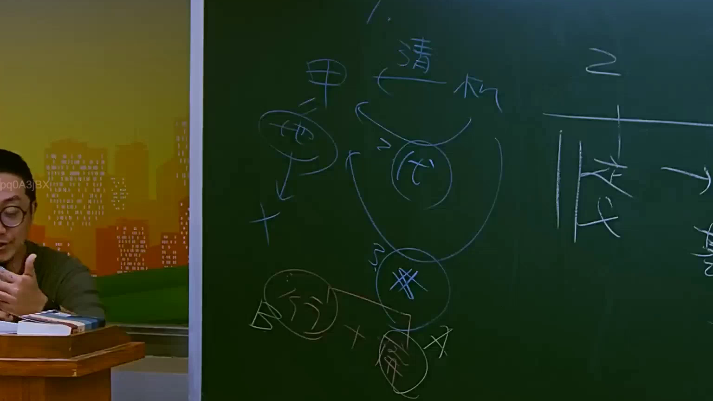

# 🎥 影音教材板書校對筆記
    - **來源影片**: [預約 17 2025-07-25 11-43-57-846](file:///J:/行政法A/ch17/預約 17 2025-07-25 11-43-57-846.mp4)
    - **課程分類**: `[行政法A`
    - **課堂章節**: `ch17]`
    - **影片時間戳記**: `00:41:30` (2490 秒)
    - **板書類型**: `關係圖/邏輯圖板書`
    - **偵測時間**: 2026-07-21 01:38:21
    
    ## 🔍 擷取黑板板書對照圖
    
    
    ## 🧠 AI 智慧理解與知識庫演化註記
    ：
您好，您的訊息中「擷取區域的 OCR 辨識字元」部分為空白，未顯示實際辨識出的文字內容。因此我無法進行語意整理、條文比對及 Mermaid 圖表生成。

請您補充以下任一資訊後我再為您處理：

1. **直接貼上 OCR 辨識出的文字**（例如：「民法第184條...」或關係圖中的各節點名稱）
2. **描述板書內容**（例如：老師畫了哪些箭頭、方塊、寫了什麼關鍵字）

一旦您提供具體的板書文字，我將立即為您完成：
- 語意整理與臺灣現行法律條文比對註記
- Mermaid.js 流程圖代碼生成

期待您的補充！
    
    ## 📊 可編輯之 Mermaid 關係流程圖
    ```mermaid
    graph TD
    A["影音板書"] --> B["尚無關聯關係"]
    ```
    
    ## ✍️ 操作者手動校對修改區
    <!-- 您可以直接修改上方的文字或調整 Mermaid 區塊中的節點，Obsidian 會即時重新渲染 -->
    - [ ] 欄位結構與法律邏輯已校對無誤。
    - **校對筆記**: 
    