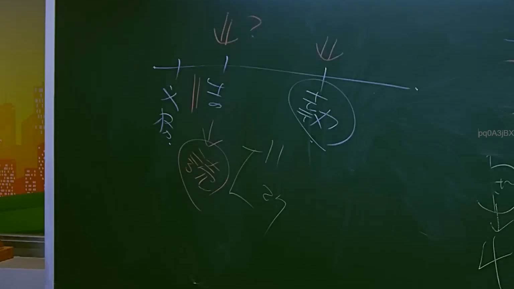

# 🎥 影音教材板書校對筆記
    - **來源影片**: [預約 17 2025-07-25 11-43-57-846](file:///J:/行政法A/ch17/預約 17 2025-07-25 11-43-57-846.mp4)
    - **課程分類**: `[行政法A`
    - **課堂章節**: `ch17]`
    - **影片時間戳記**: `00:56:15` (3375 秒)
    - **板書類型**: `關係圖/邏輯圖板書`
    - **偵測時間**: 2026-07-21 01:41:07
    
    ## 🔍 擷取黑板板書對照圖
    
    
    ## 🧠 AI 智慧理解與知識庫演化註記
    ：
OCR 辨識字元內容為空，無法進行語意整理與法律條文比對。請提供實際擷取區域的 OCR 文字內容（例如老師在黑板上書寫的具體字句），我才能完成以下工作：

1. **語意整理** — 將板書文字歸納為法律概念、要件或邏輯關係
2. **知識庫比對與理解演化註記** — 與民法第184條（侵權行為）、消滅時效等現行條文進行對位分析
3. **Mermaid.js 流程圖代碼** — 依板書結構生成對應的邏輯關係圖

請補充 OCR 辨識字元，我將立即為您完成分析。
    
    ## 📊 可編輯之 Mermaid 關係流程圖
    ```mermaid
    graph TD
    A["影音板書"] --> B["尚無關聯關係"]
    ```
    
    ## ✍️ 操作者手動校對修改區
    <!-- 您可以直接修改上方的文字或調整 Mermaid 區塊中的節點，Obsidian 會即時重新渲染 -->
    - [ ] 欄位結構與法律邏輯已校對無誤。
    - **校對筆記**: 
    