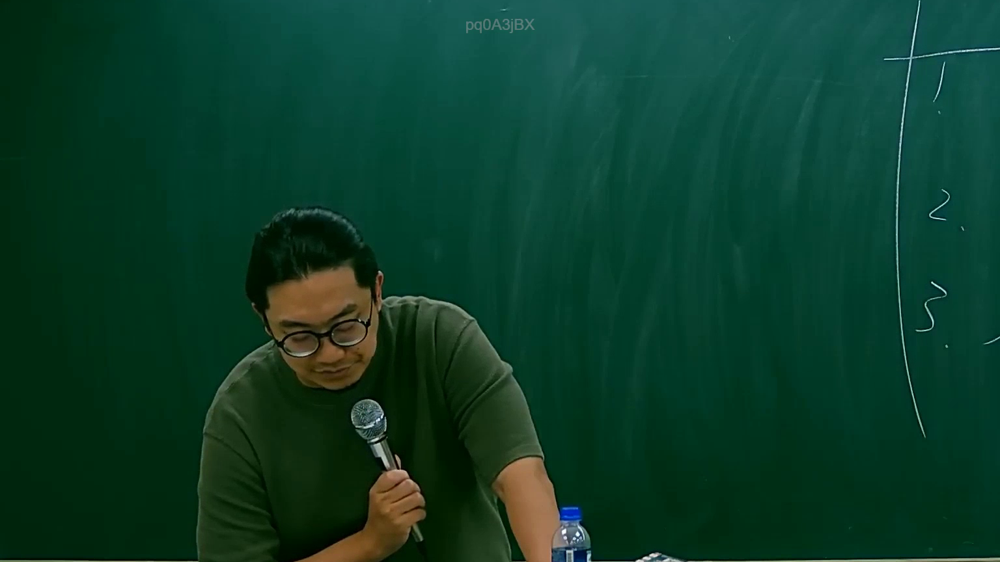

# 🎥 影音教材板書校對筆記
    - **來源影片**: [預約 19 2025-07-29 18-06-30-572](file:///J:/行政法A/ch19/預約 19 2025-07-29 18-06-30-572.mp4)
    - **課程分類**: `[行政法A`
    - **課堂章節**: `ch19]`
    - **影片時間戳記**: `01:33:30` (5610 秒)
    - **板書類型**: `關係圖/邏輯圖板書`
    - **偵測時間**: 2026-07-21 02:39:23
    
    ## 🔍 擷取黑板板書對照圖
    
    
    ## 🧠 AI 智慧理解與知識庫演化註記
    ：

您好！您的訊息中「擷取區域的 OCR 辨識字元如下：」之後，**實際的文字內容並未附上**（為空白）。因此我無法針對板書文字進行語意整理、法律條文比對或生成 Mermaid 流程圖。

請您重新提供以下任一格式的內容後，我再為您完成分析：

1. **直接貼上 OCR 辨識出的文字**
2. **描述板書上的關鍵詞與邏輯關係**（例如：「左側寫『侵權行為』，右側分三支箭頭指向『故意不法』、『過失』、『消滅時效』」）

---

一旦您提供內容，我會立即為您完成：

- 📖 **知識庫比對與理解演化註記**（對照民法第184條、侵權行為責任、消滅時效等現行法條）
- 🔄 **Mermaid.js 流程圖代碼**（關係圖/邏輯圖版式，節點文字以雙引號括住）

請補充資料，我隨時待命！
    
    ## 📊 可編輯之 Mermaid 關係流程圖
    ```mermaid
    graph TD
    A["影音板書"] --> B["尚無關聯關係"]
    ```
    
    ## ✍️ 操作者手動校對修改區
    <!-- 您可以直接修改上方的文字或調整 Mermaid 區塊中的節點，Obsidian 會即時重新渲染 -->
    - [ ] 欄位結構與法律邏輯已校對無誤。
    - **校對筆記**: 
    