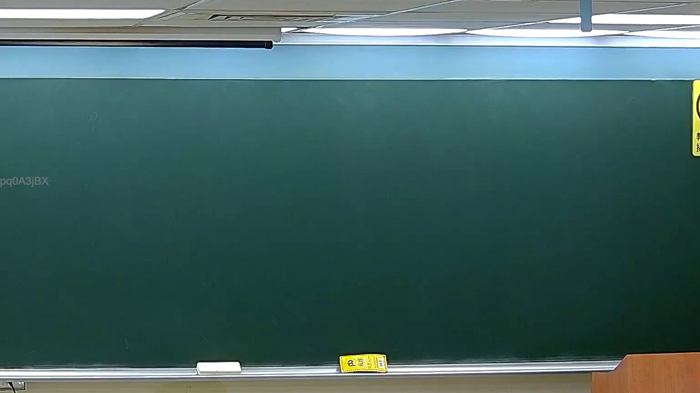

# 🎥 影音教材板書校對筆記
    - **來源影片**: [預約 19 2026-04-03 21-11-09-227](file:///J:/刑法B115/ch19/預約 19 2026-04-03 21-11-09-227.mp4)
    - **課程分類**: `[刑法B115`
    - **課堂章節**: `ch19]`
    - **影片時間戳記**: `01:06:15` (3975 秒)
    - **板書類型**: `關係圖/邏輯圖板書`
    - **偵測時間**: 2026-07-21 01:44:51
    
    ## 🔍 擷取黑板板書對照圖
    
    
    ## 🧠 AI 智慧理解與知識庫演化註記
    ：
您提供的訊息中，OCR 辨識字元區域為空白（未擷取到任何文字內容）。因此我無法進行以下工作：

1. **語意整理** — 無辨識文字可分析。
2. **條文比對** — 無法將板書內容與民法第184條、侵權行為、消滅時效等現行法律條文進行對位。
3. **Mermaid 流程圖生成** — 缺乏邏輯關係資料，無法繪製圖表。

---
    
    ## 📊 可編輯之 Mermaid 關係流程圖
    ```mermaid
    ：
（待您補充 OCR 辨識文字後再產出）

---

📌 **請提供以下任一方式讓我繼續協助：**

- 將板書上的文字內容貼上給我（可直接複製貼上）。
- 或重新執行截圖並提供 OCR 結果。

一旦收到文字資料，我將立即為您完成：
1. 語意整理與法律條文比對註記
2. Mermaid.js 流程圖代碼生成
    ```
    
    ## ✍️ 操作者手動校對修改區
    <!-- 您可以直接修改上方的文字或調整 Mermaid 區塊中的節點，Obsidian 會即時重新渲染 -->
    - [ ] 欄位結構與法律邏輯已校對無誤。
    - **校對筆記**: 
    