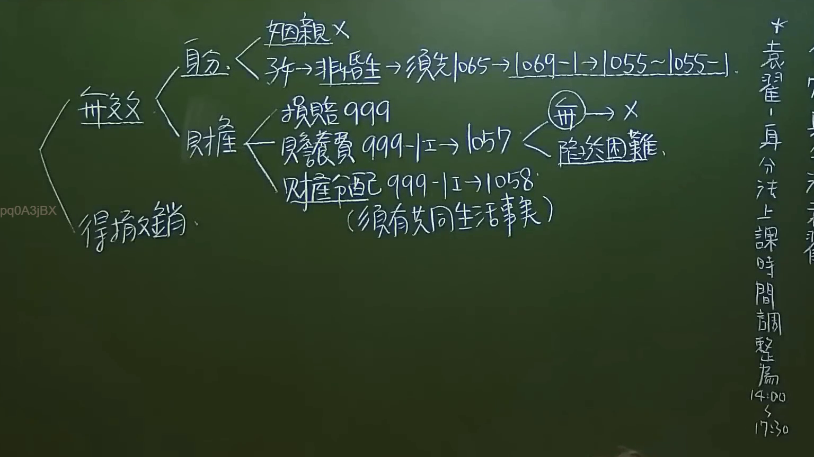

# 🎥 影音教材板書校對筆記
- **來源影片**: [預約 2 2024-09-20 21-36-21-212](file:///J:/身分法/ch2/預約 2 2024-09-20 21-36-21-212.mp4)
- **課程分類**: `[身分法`
- **課堂章節**: `ch2]`
- **影片時間戳記**: `00:27:15` (1635 秒)
- **板書類型**: `影音板書`
- **偵測時間**: 2026-07-19 17:58:43

## 🔍 擷取黑板板書對照圖


## 🧠 AI 智慧理解與知識庫演化註記
：
本板書旨在說明「婚姻無效」與「得撤銷婚姻」在法律效果上的體系架構，特別著重於婚姻關係消滅後的身分與財產法律效果。

1. **身分效力**：
   - 婚姻無效後，若涉及子女，透過「準用」概念連結至親屬編規範。
   - 辨識文字：身分 -> 姻親X（無效婚姻不成立姻親關係）、子女 -> 非婚生 -> 須先1065 -> 1069-1 -> 1055~1055-1。意指婚姻無效後，子女身分回復為非婚生子女，經認領後準用相關撫育及親權行使規定。

2. **財產效力**：
   - 損害賠償：民法第999條（婚約之損害賠償）。
   - 贍養費：民法第999-1條準用第1057條，特別強調「無過失」且「陷於生活困難」之要件。
   - 財產分配：民法第999-1條準用第1058條，強調須有「共同生活事實」為前提。

3. **法律對照**：
   - 法律體系將婚姻無效/撤銷後的財產問題，高度連結至離婚後的法律效果。
   - 板書關鍵點：「無 -> X」意指無過失方可請求，且「陷於困難」為贍養費請求之核心門檻。

## 📊 可編輯之 Mermaid 關係流程圖
```mermaid
：
graph LR
    A["婚姻效力狀態"] --> B["無效"]
    A --> C["得撤銷"]
    B --> D["身分"]
    B --> E["財產"]
    D --> D1["姻親 X"]
    D --> D2["子女 非婚生"]
    D2 --> D3["準用 1065 -> 1069-1 -> 1055~1055-1"]
    E --> E1["損害賠償 999"]
    E --> E2["贍養費 999-1 -> 1057"]
    E --> E3["財產分配 999-1 -> 1058"]
    E2 --> E4["要件 無過失 -> 陷於困難"]
    E3 --> E5["要件 須有共同生活事實"]
```

## ✍️ 操作者手動校對修改區
<!-- 您可以直接修改上方的文字或調整 Mermaid 區塊中的節點，Obsidian 會即時重新渲染 -->
- [ ] 欄位結構與法律邏輯已校對無誤。
- **校對筆記**: 
