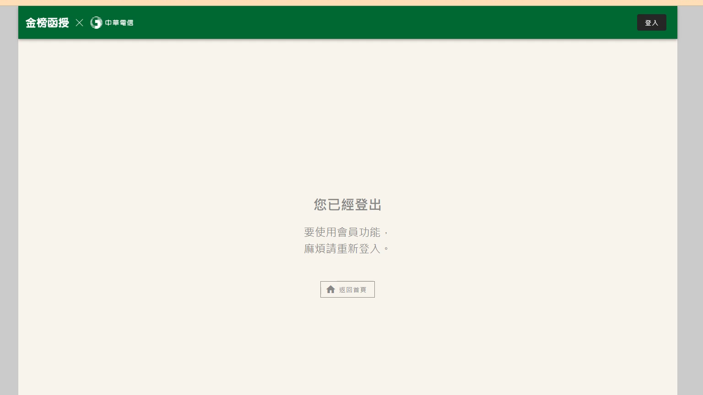

# 🎥 影音教材板書校對筆記
- **來源影片**: [預約 2 2024-09-20 21-36-21-212](file:///J:/身分法/ch2/預約 2 2024-09-20 21-36-21-212.mp4)
- **課程分類**: `[身分法`
- **課堂章節**: `ch2]`
- **影片時間戳記**: `00:28:30` (1710 秒)
- **板書類型**: `影音板書`
- **偵測時間**: 2026-07-19 17:58:49

## 🔍 擷取黑板板書對照圖


## 🧠 AI 智慧理解與知識庫演化註記
：
您提供的圖片並非教學板書，而是「金榜函授」數位學習平台的系統提示頁面。

1. **辨識內容**：
   - 頂部導覽列顯示「金榜函授」與「中華電信」標識，並有「登入」按鈕。
   - 畫面中央顯示：「您已經登出」、「要使用會員功能，麻煩請重新登入。」
   - 下方提供一個「返回首頁」的按鈕。

2. **法律註記與情境說明**：
   - 此畫面反映的是數位教學服務中常見的「登入逾時」或「連線中斷」狀態，涉及使用者與平台提供者之間的「數位內容服務定型化契約」。
   - 依據《數位內容服務定型化契約應記載及不得記載事項》，平台業者有義務維持服務之穩定性。若因系統自動登出導致使用者無法存取已購買的課程權益，通常屬於正常的安全機制（Session Timeout），用以保護使用者帳號安全，避免共用帳號或未授權存取。
   - 建議您重新登入以恢復對影音教學內容的存取，屆時若仍無法閱讀教材，可能涉及系統維護或服務異常，則需聯繫客服處理。

## 📊 可編輯之 Mermaid 關係流程圖
```mermaid
：
graph TD
    A["使用者"] -->|操作請求| B{"金榜函授平台"}
    B -->|身分驗證失效| C["系統顯示：您已經登出"]
    C -->|引導| D["重新登入/返回首頁"]
    D -->|恢復權限| B
```

## ✍️ 操作者手動校對修改區
<!-- 您可以直接修改上方的文字或調整 Mermaid 區塊中的節點，Obsidian 會即時重新渲染 -->
- [ ] 欄位結構與法律邏輯已校對無誤。
- **校對筆記**: 
