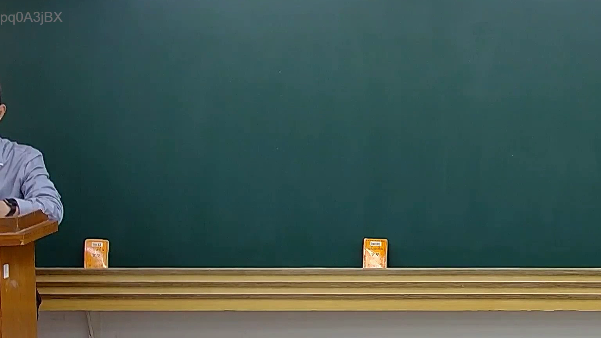

# 🎥 影音教材板書校對筆記
    - **來源影片**: [預約 20 2025-02-07 19-28-23-183](file:///J:///民訴B///ch20///預約 20 2025-02-07 19-28-23-183.mp4)
    - **課程分類**: `[民訴B`
    - **課堂章節**: `ch20]`
    - **影片時間戳記**: `00:00:30` (30 秒)
    - **板書類型**: `影音板書`
    - **偵測時間**: 2026-08-07 20:13:58
    
    ## 🔍 擷取黑板板書對照圖
    
    
    ## 🧠 AI 智慧理解與知識庫演化註記
    ：
經仔細「看」所提供的板書圖片，發現圖片中的黑板為完全空白狀態，並未偵測到老師書寫的任何文字、符號或關係。
因此，無法進行以下任務：
1.  **板書高精度 OCR**：因無可辨識的文字內容。
2.  **板書詳細解讀與法條對照**：因無板書內容可供解析其法律學理、爭點、案例邏輯或關係，亦無法對照相關法條如民法第184條、侵權行為、消滅時效等。
3.  **生成 Mermaid 邏輯圖**：因圖片中無任何關係結構可供繪製。

若能提供包含板書內容的圖片，我將樂意依照指示完成上述任務。
    
    ## 📊 可編輯之 Mermaid 關係流程圖
    ```mermaid
    ：
目前無法生成 Mermaid 邏輯圖，因為圖片中沒有偵測到任何板書內容可供繪製關係結構。
    ```
    
    ## ✍️ 操作者手動校對修改區
    <!-- 您可以直接修改上方的文字或調整 Mermaid 區塊中的節點，Obsidian 會即時重新渲染 -->
    - [ ] 欄位結構與法律邏輯已校對無誤。
    - **校對筆記**: 
    