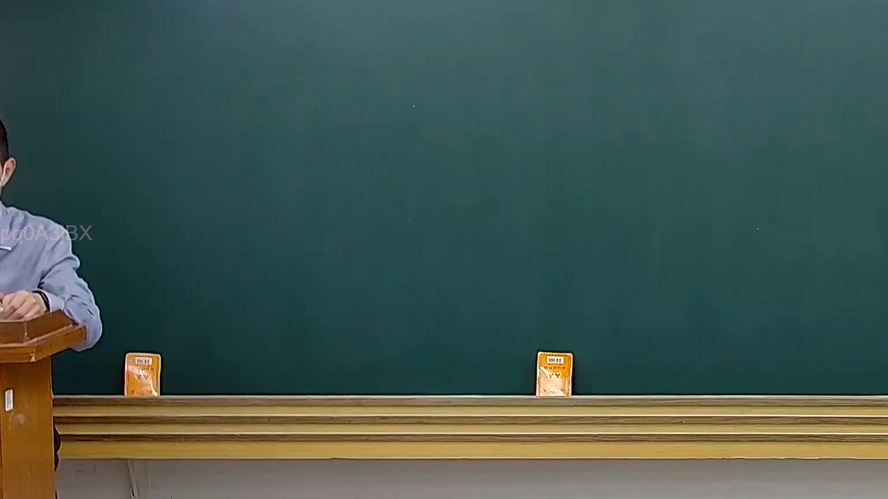

# 🎥 影音教材板書校對筆記
    - **來源影片**: [預約 20 2025-02-07 19-28-23-183](file:///J:///民訴B///ch20///預約 20 2025-02-07 19-28-23-183.mp4)
    - **課程分類**: `[民訴B`
    - **課堂章節**: `ch20]`
    - **影片時間戳記**: `00:02:15` (135 秒)
    - **板書類型**: `影音板書`
    - **偵測時間**: 2026-08-07 20:14:06
    
    ## 🔍 擷取黑板板書對照圖
    
    
    ## 🧠 AI 智慧理解與知識庫演化註記
    ：
經高精度分析影像在時間點 2分15秒的板書圖片，確認板書區域為完全空白，沒有偵測到任何文字、符號或圖形。因此無法進行板書內容的辨識、解讀或法條對照。
    
    ## 📊 可編輯之 Mermaid 關係流程圖
    ```mermaid
    ：
graph TD
    A["板書空白"]
    ```
    
    ## ✍️ 操作者手動校對修改區
    <!-- 您可以直接修改上方的文字或調整 Mermaid 區塊中的節點，Obsidian 會即時重新渲染 -->
    - [ ] 欄位結構與法律邏輯已校對無誤。
    - **校對筆記**: 
    