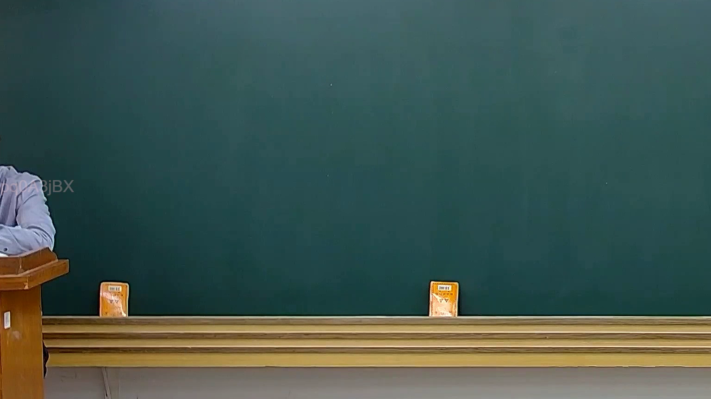

# 🎥 影音教材板書校對筆記
    - **來源影片**: [預約 20 2025-02-07 19-28-23-183](file:///J:///民訴B///ch20///預約 20 2025-02-07 19-28-23-183.mp4)
    - **課程分類**: `[民訴B`
    - **課堂章節**: `ch20]`
    - **影片時間戳記**: `00:03:15` (195 秒)
    - **板書類型**: `影音板書`
    - **偵測時間**: 2026-08-07 20:14:29
    
    ## 🔍 擷取黑板板書對照圖
    
    
    ## 🧠 AI 智慧理解與知識庫演化註記
    ：
經仔細分析所提供的圖片，本助理未能辨識出黑板上老師書寫的任何文字、符號或關係。圖片中的黑板表面為空白狀態，僅可見畫面左側部分老師的身影及講台，以及黑板下方置物槽上的兩個小型橘色物件（疑似書籍或教具）。這些物件上的文字因解析度關係無法清晰辨識，且不屬於板書範疇。
因此，本次任務中關於「板書高精度 OCR」所辨識出的文字內容為：[無]。
由於圖片中缺乏板書內容，故無法依據板書進行法律學理、爭點、案例邏輯或關係的詳細解讀，亦無法對照臺灣現行法律條文（如民法第184條、侵權行為、消滅時效等），或生成對應的Mermaid邏輯圖。本助理在此重申，所有分析均需以圖片中實際呈現的資訊為基礎。
    
    ## 📊 可編輯之 Mermaid 關係流程圖
    ```mermaid
    ：
graph TD
    A["黑板上無可辨識之板書"]
    ```
    
    ## ✍️ 操作者手動校對修改區
    <!-- 您可以直接修改上方的文字或調整 Mermaid 區塊中的節點，Obsidian 會即時重新渲染 -->
    - [ ] 欄位結構與法律邏輯已校對無誤。
    - **校對筆記**: 
    