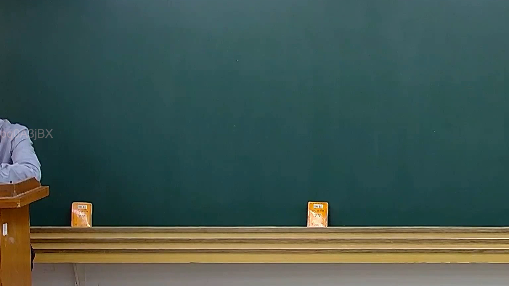

# 🎥 影音教材板書校對筆記
    - **來源影片**: [預約 20 2025-02-07 19-28-23-183](file:///J:///民訴B///ch20///預約 20 2025-02-07 19-28-23-183.mp4)
    - **課程分類**: `[民訴B`
    - **課堂章節**: `ch20]`
    - **影片時間戳記**: `00:03:45` (225 秒)
    - **板書類型**: `影音板書`
    - **偵測時間**: 2026-08-07 20:14:44
    
    ## 🔍 擷取黑板板書對照圖
    
    
    ## 🧠 AI 智慧理解與知識庫演化註記
    ：
1.  **板書高精度 OCR 辨識結果**：
    經仔細檢視圖片，老師所書寫的黑板上並未偵測到任何文字、符號或圖形。黑板區域為完全空白狀態。
    在黑板下方的木質層架上，可見兩本小書（推測為法典或教科書），但其上文字因距離與解析度關係無法清晰辨識，且不屬於老師「書寫在板書上」的內容。

2.  **板書詳細解讀與法條對照**：
    由於圖片中老師的黑板上無任何板書內容可供辨識，因此無法從板書本身解讀任何法律學理、爭點、案例邏輯或關係。同樣地，亦無法依據板書內容自動對照並聯想臺灣現行法律條文，如民法第184條（侵權行為）、消滅時效或其他相關法條。本時間點的影像畫面僅顯示空白黑板，不含任何可供法律分析的視覺資訊。
    
    ## 📊 可編輯之 Mermaid 關係流程圖
    ```mermaid
    ：
由於圖片中的黑板上並無任何文字、符號或關係結構可供分析，因此無法生成對應的 Mermaid.js 關係圖代碼。
    ```
    
    ## ✍️ 操作者手動校對修改區
    <!-- 您可以直接修改上方的文字或調整 Mermaid 區塊中的節點，Obsidian 會即時重新渲染 -->
    - [ ] 欄位結構與法律邏輯已校對無誤。
    - **校對筆記**: 
    