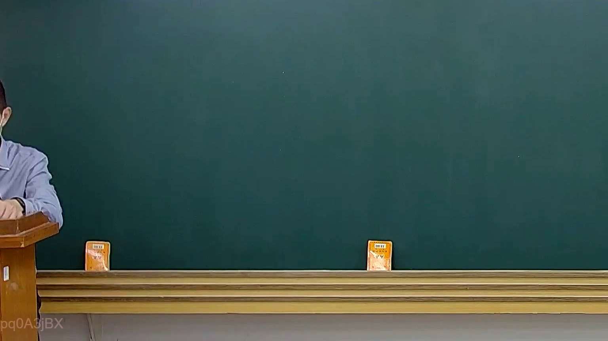

# 🎥 影音教材板書校對筆記
    - **來源影片**: [預約 20 2025-02-07 19-28-23-183](file:///J:///民訴B///ch20///預約 20 2025-02-07 19-28-23-183.mp4)
    - **課程分類**: `[民訴B`
    - **課堂章節**: `ch20]`
    - **影片時間戳記**: `00:08:00` (480 秒)
    - **板書類型**: `影音板書`
    - **偵測時間**: 2026-08-07 17:47:16
    
    ## 🔍 擷取黑板板書對照圖
    
    
    ## 🧠 AI 智慧理解與知識庫演化註記
    ：
經高精度分析，圖片中的黑板完全空白，未偵測到任何老師書寫的文字、符號或關係。因此，無法依據板書內容進行法律學理、爭點、案例邏輯的解讀，亦無法對照相關法律條文。
    
    ## 📊 可編輯之 Mermaid 關係流程圖
    ```mermaid
    ：
(黑板無任何書寫內容，故無可生成之 Mermaid 程式碼)
    ```
    
    ## ✍️ 操作者手動校對修改區
    <!-- 您可以直接修改上方的文字或調整 Mermaid 區塊中的節點，Obsidian 會即時重新渲染 -->
    - [ ] 欄位結構與法律邏輯已校對無誤。
    - **校對筆記**: 
    